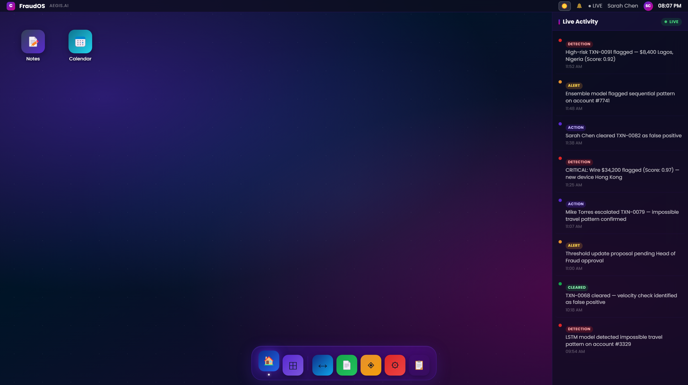
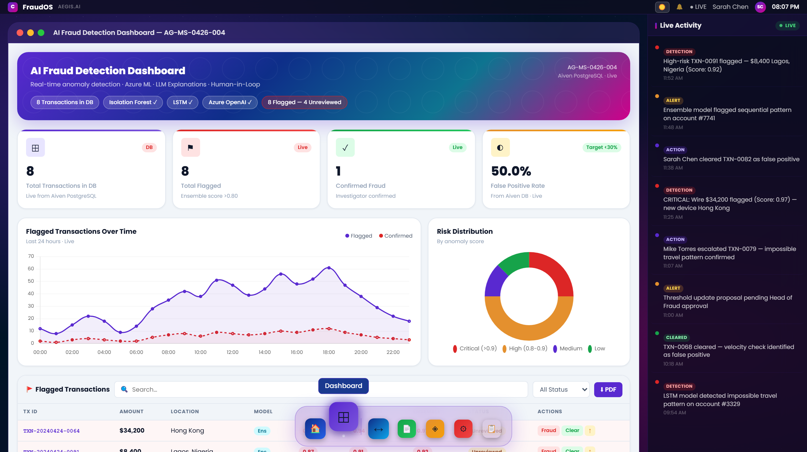
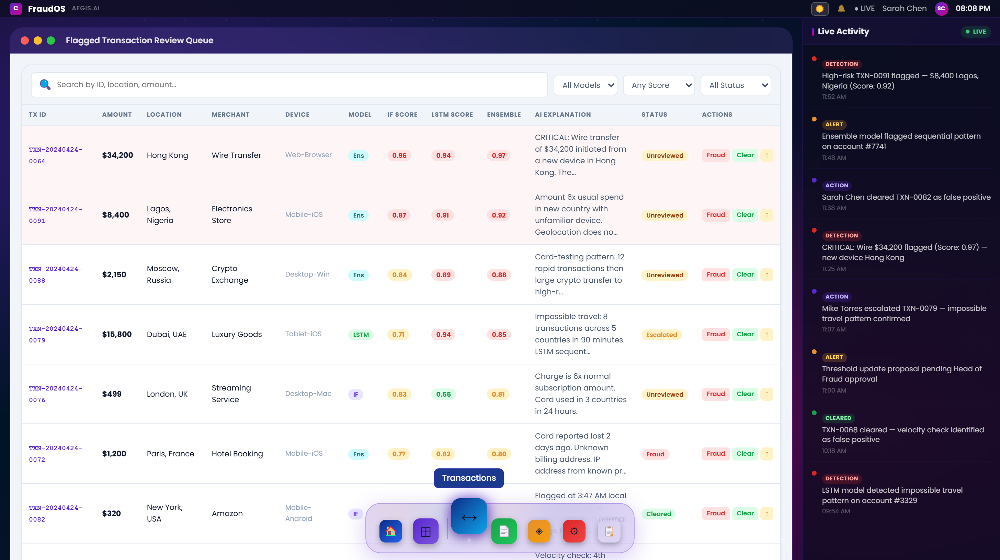
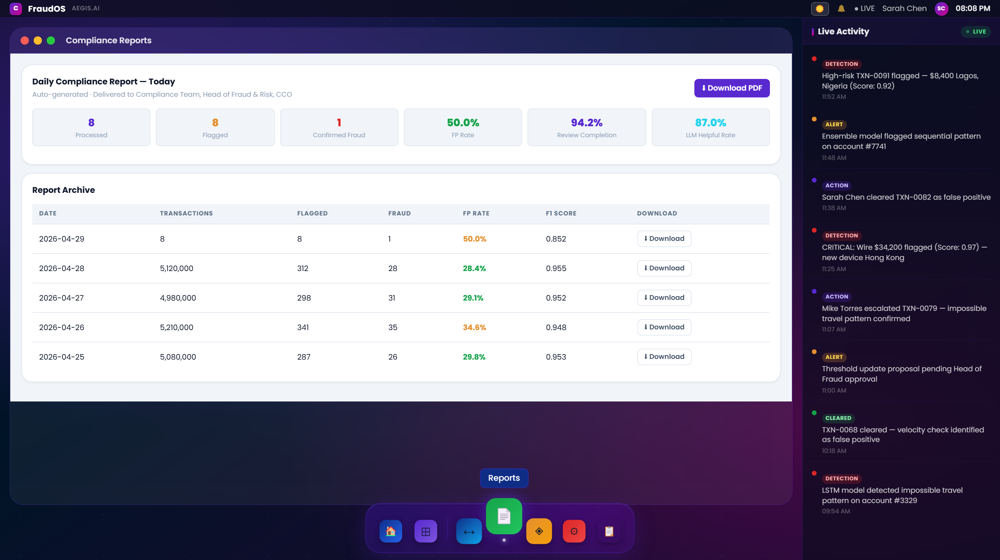
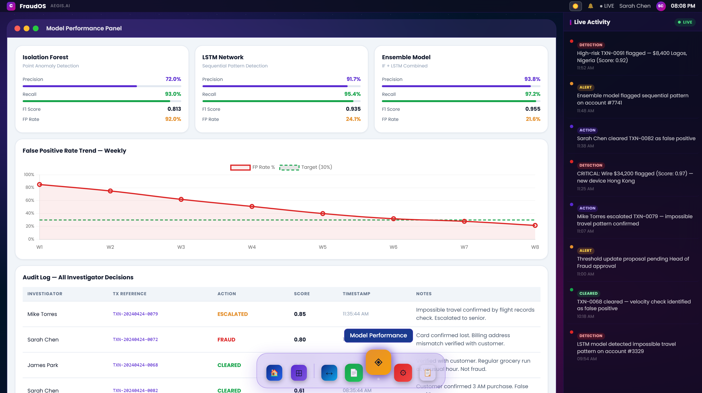
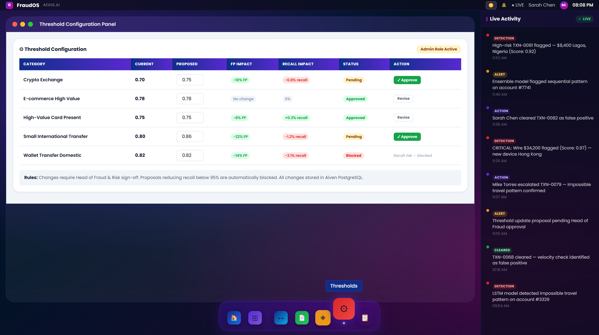
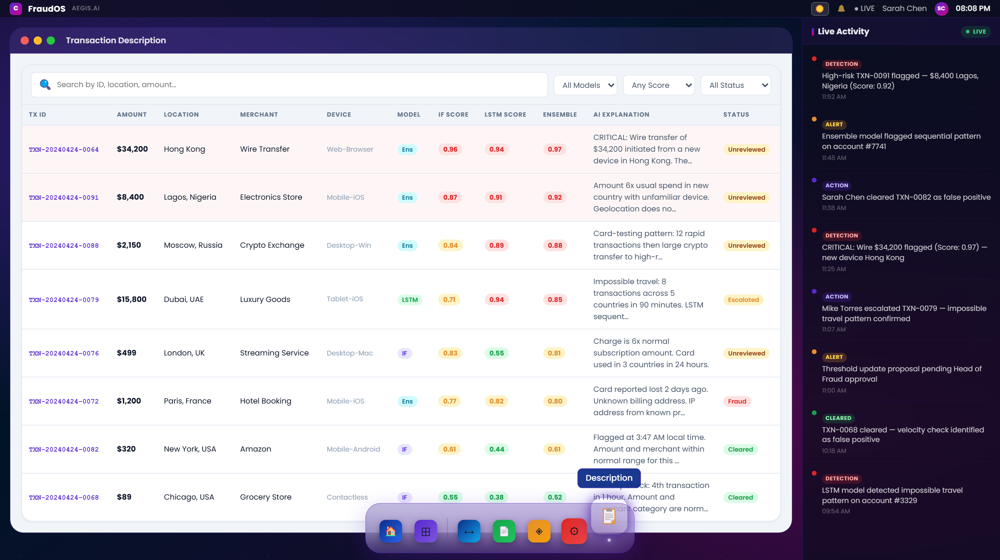

# FraudOS — AEGIS.AI

## Virtual Humanoid User Flow Specification

*AI Execution Specification — Fraud Investigation Happy Flow (MVP)*
*Agent: Rahul*

This document is the execution-ready specification for a virtual humanoid (Agent Rahul) operating the FraudOS — AEGIS.AI fraud detection platform. Every screen, element, action, narration, and recovery rule is grounded in the actual MVP UI shown in the attached screenshots and aligned with the Business Requirements Document (V1-MVP-R2). The flow follows the BRD-mandated sequence: real-time monitoring (BR-006) → human-in-the-loop review (BR-004) → daily compliance reporting (BR-005) → model performance review → threshold configuration submission (BR-001 / BR-002).

| Field | Value |
|---|---|
| Application | FraudOS — AEGIS.AI |
| Agent Name / Code | Rahul |
| Primary user role | Fraud Investigator (Sarah Chen) |
| Execution actor | Virtual humanoid operating FraudOS in a browser |
| Created on | 2026-04-29 |
| Flow covered | Fraud Investigation Happy Flow — end-to-end (MVP scope) |
| Viewport baseline | 1456 x 816 browser viewport, 100% zoom |
| Coordinate origin | Top-left of browser content area (below address bar) |
| Template status | MVP-scoped, execution-ready |
| Linked BRD | AI-Powered Financial Anomaly Detection and Reporting (V1-MVP-R2) |

---

## 1. Prototype Scenario

This document uses FraudOS (running at localhost or production deployment) as the target application. All screens, coordinates, selectors, and narrations are derived from the actual MVP UI and from the BRD UI requirements UI-01 through UI-07.

| Area | Detail |
|---|---|
| Web application | FraudOS — AEGIS.AI |
| Purpose | AI-powered fraud detection platform with Isolation Forest (primary detection model per BRD Section 1), LSTM (visual indicator only — deferred to Phase 2), Ensemble scoring, Azure OpenAI plain-English explanations (BR-003), human-in-the-loop review (BR-004), threshold submission (BR-001/BR-002), daily compliance reporting (BR-005), and real-time monitoring dashboard (BR-006). |
| Main desktop URL | http://134.33.132.134/rahul-aegis-fe |
| Primary business flow | Investigator opens home (SCR-001-HOME) → reviews dashboard KPIs (SCR-002-DASHBOARD) → inspects flagged transaction queue (SCR-003-TX-QUEUE) → confirms or clears flagged cases → views compliance report (SCR-004-REPORTS) → reviews model performance and audit log (SCR-005-MODEL-PERF) → submits threshold approvals (SCR-006-THRESHOLDS). The new Description page (SCR-007-DESCRIPTION) provides a read-only transaction view available from the taskbar. |
| Primary audience | A human supervisor watching the humanoid operate FraudOS and explain each decision. |
| Cultural / language tone | British English. Plain financial language. No ML jargon in investigator-facing output (per BRD Cultural Tone Guidelines). |

---

## 2. Complete Flow Identification

| Field | Required | Description | Filled Value |
|---|---|---|---|
| flow_id | Yes | Unique ID for the business journey. | FLOW-FRAUDOS-INVEST-001 |
| flow_name | Yes | Human-readable name. | FraudOS Fraud Investigation Happy Flow |
| flow_version | Yes | Version used by AI runtime. | 1.0 |
| parent_flow_id | No | Parent flow if this is a child. | None |
| business_goal | Yes | Why the user wants the flow performed. | Review all flagged transactions, confirm real fraud, clear false positives (BR-004), validate model performance against MET-01 to MET-06, and submit pending threshold changes for approval (BR-001/BR-002). |
| persona | Yes | Role simulated by humanoid. | Fraud Investigator (Sarah Chen) |
| trigger_utterance | Yes | User command that starts the flow. | Review today's flagged transactions and explain the fraud findings. |
| entry_screen_id | Yes | First screen where execution begins. | SCR-001-HOME |
| expected_end_screen_id | Yes | Final screen after successful execution. | SCR-006-THRESHOLDS |
| narration_mode | Yes | How much the humanoid speaks. | Detailed guided walkthrough |
| evidence_required | Yes | Whether screenshots/logs are required. | Yes — capture screenshot at each major screen (per AC-09 audit log completeness) |

---

## 3. Required Runtime Parameters

| Parameter | Required | Type | Example | How AI Uses It |
|---|---|---|---|---|
| session_id | Yes | String | FRAUDOS-SESSION-001 | Correlates all actions, screenshots, and audit log entries (AC-09). |
| user_role | Yes | String | Fraud Investigator | Determines workspace and explanation level (per BRD Section 4.4 RBAC). |
| investigator_name | Yes | String | Sarah Chen | Used for audit log validation and Live Activity event matching. |
| review_date | Yes | String | 2026-04-29 | Used to verify compliance report date matches today (R-01). |
| agent_code | Yes | String | AG-MS-0426-004-MVP | Validates dashboard banner reference ID (AG-MS-0426-004 visible top-right of dashboard). |
| viewport_width | Yes | Number | 1456 | Used for coordinates and region map. |
| viewport_height | Yes | Number | 816 | Used for coordinates and region map. |
| speaker_style | Yes | Enum | Professional, concise, explanatory | Controls humanoid narration tone (per BRD Tone guideline). |
| target_fp_rate | Yes | Number | 30 (percent) | Compared against current FP Rate KPI (Target <30% per MET-01). |
| recall_floor | Yes | Number | 95 (percent) | Hard floor — used to validate threshold approval safety (MET-04 / Constraint 3). |

---

## 4. UI/UX Screen Inventory: Where the Humanoid Goes

Each screen ID below maps directly to a discrete screen in the FraudOS application. The same screen IDs are referenced throughout Sections 6 to 20. The humanoid navigates through the seven MVP screens listed below. Notes and Calendar are accessible from the desktop as single-click icons (utility modals, not part of the main investigation flow).

| Screen ID | Screen Name | URL / Route | Purpose | Source UI Reference | Expected Visible Evidence |
|---|---|---|---|---|---|
| SCR-001-HOME | FraudOS Home Desktop | / | Main app launcher with desktop icons (Notes, Calendar only), taskbar dock with seven module shortcuts, and Live Activity feed (BR-006). | UI Screen 1 (revised) | Two desktop icons: Notes (📝, `#desktop-notes-icon`) and Calendar (📅, `#desktop-calendar-icon`); taskbar dock with Desktop, Dashboard, Transactions, Reports, Model Perf, Thresholds, Description; Live Activity panel (`#commentaryFeed`) with DETECTION / CLEARED events; LIVE badge green; Sarah Chen in top-right. |
| SCR-002-DASHBOARD | AI Fraud Detection Dashboard | /dashboard | Real-time KPI dashboard satisfying UI-02 / BR-006. Shows banner with agent code, four KPI tiles, flagged transactions chart, risk distribution donut, and flagged transactions table. | UI Screens 2, 3, 4 | Banner 'AI Fraud Detection Dashboard — AG-MS-0426-004'; Isolation Forest, LSTM, Azure OpenAI badges; '8 Flagged — 0 Unreviewed' chip; KPI tiles `#dashboard-kpi-total`, `#dashboard-kpi-flagged`, `#dashboard-kpi-fraud`, `#dashboard-kpi-fprate` showing 8 / 8 / 5 / 37.5%; line chart `#dashboard-timeseries-chart` over 24 hours; donut `#dashboard-riskdist-chart` with Critical / High / Medium / Low; flagged table `#dashboard-tx-table` with 8 transactions. |
| SCR-003-TX-QUEUE | Flagged Transaction Review Queue | /transactions | Detailed investigator review queue satisfying UI-01 / BR-004. Shows AI explanation column (UI-05), model scores per row, and Fraud / Clear action buttons. | UI Screen 5 | Search bar `#transactions-search-input`; All Models filter `#transactions-model-select`; Any Score filter `#transactions-score-select`; All Status filter `#transactions-status-select`; transactions table `#transactions-table` with rows like `#tx-row-{id}` for TXN-20240424-0064, 0091, 0088; AI Explanation column with critical / contextual narratives; Fraud (`#tx-{id}-fraud-btn`) and Clear (`#tx-{id}-clear-btn`) buttons per row. |
| SCR-004-REPORTS | Compliance Reports | /reports | Daily compliance report and historical archive satisfying UI-06 / BR-005 / R-01. | UI Screen 6 | Daily Compliance Report card with: 8 Processed, 8 Flagged, 5 Confirmed Fraud, 37.5% FP Rate, 94.2% Review Completion, 87.0% LLM Helpful Rate; Download PDF button `#reports-today-download-btn`; Report Archive table `#reports-archive-table` with rows `#reports-archive-row-{date}` for 2026-04-29 through 2026-04-22 with daily metrics and Download buttons `#reports-archive-download-btn-{date}`. |
| SCR-005-MODEL-PERF | Model Performance Panel | /model-perf | Model metrics panel satisfying UI-03 / R-02. Shows three model cards, weekly FP rate trend, and full investigator audit log. | UI Screens 7, 8 | Three cards: `#model-perf-card-isolation_forest` (72.0% / 93.0% / 0.813 / 92.0%), `#model-perf-card-lstm` (91.7% / 95.4% / 0.935 / 24.1%), `#model-perf-card-ensemble` (93.8% / 97.2% / 0.955 / 21.6%); FP Rate Trend chart `#model-fp-chart` with Target 30% line; Audit Log `#model-audit-table` with Sarah Chen entries by TX reference, action, score, timestamp. |
| SCR-006-THRESHOLDS | Threshold Configuration Panel | /thresholds | Restricted submission interface satisfying UI-04 / BR-001 / BR-002. Shows current vs proposed thresholds, FP / Recall impact, status, and Approve / Revise actions. | UI Screen 9 | Admin Role Active badge `#threshold-admin-badge`; threshold table `#threshold-table` with rows `#threshold-row-{id}` for Crypto Exchange (0.70 → 0.75, Pending), E-commerce High Value (0.78 → 0.78, Approved), High-Value Card Present (0.75 → 0.75, Approved), Small International Transfer (0.80 → 0.86, Pending), Wallet Transfer Domestic (0.82 → 0.82, Blocked); Approve buttons `#threshold-approve-btn-{id}`; Rules note `#threshold-rules-note` referencing Head of Fraud & Risk sign-off and 95% recall floor. |
| SCR-007-DESCRIPTION | Transaction Description (Read-Only) | /description | Read-only transaction inventory view. Identical column set to the Transactions queue but without action buttons — used for inspection, audit handoff, and stakeholder demos without risk of accidental action. | New screen | WinChrome `#description-chrome`; search bar `#description-search-input`; filters `#description-model-select`, `#description-score-select`, `#description-status-select`; description table `#description-table` with all flagged transaction rows; no Actions column. |

---

## 5. Screen Layout Region Map

Coordinates are based on a 1456 x 816 viewport. Top-left origin is the browser content area below the address bar. Each region is referenced by Region ID throughout Sections 6 to 9.

| Region ID | Applies To (Screen ID) | Pixel Bounds (x1, y1, x2, y2) | Description | Example AI Instruction |
|---|---|---|---|---|
| REG-TOP-NAV | All screens | 0, 0, 1456, 115 | Top bar with FraudOS logo, AEGIS.AI label (`#menubar`), notification bell (`#menubar-notification-btn`), LIVE badge (`#menubar-live-status`), user name (`#menubar-user-name`), avatar (`#menubar-avatar`), and time. | Verify LIVE badge is green and user shows Sarah Chen before proceeding. |
| REG-ICON-GRID | SCR-001-HOME | 30, 130, 1110, 760 | Desktop icon grid (`#desktop-grid`) — contains only two single-click utility icons: Notes (`#desktop-notes-icon`) and Calendar (`#desktop-calendar-icon`). All other modules moved to the taskbar dock. | Locate Notes or Calendar desktop icon and click once to open the modal. For module navigation use REG-TASKBAR. |
| REG-LIVE-ACTIVITY | SCR-001-HOME (also visible on SCR-002 to SCR-007) | 1135, 130, 1456, 816 | Right-rail Live Activity feed (`#commentary-section` / `#commentaryFeed`) showing real-time CLEARED and DETECTION events with timestamps. Each event has id `#activity-item-{id}`. | Read top 3 events to confirm recent activity before opening any screen. |
| REG-TASKBAR | All screens (persistent dock) | 470, 665, 990, 760 | Bottom dock (`#dock`) with seven shortcut icons: Desktop (`#dock-desktop`), Dashboard (`#dock-dashboard`), separator, Transactions (`#dock-transactions`), Reports (`#dock-reports`), Model Performance (`#dock-model`), Thresholds (`#dock-threshold`), Description (`#dock-description`). This is the primary navigation surface. | Use taskbar to switch modules. The module icons that previously lived on the desktop now live here. |
| REG-DASH-BANNER | SCR-002-DASHBOARD | 30, 200, 1110, 360 | Banner with title, agent code (AG-MS-0426-004), Aiven PostgreSQL · Live indicator, model badges, and flagged-count chip. | Read banner to confirm correct screen and verify model badges are present. |
| REG-KPI-TILES | SCR-002-DASHBOARD | 30, 360, 1110, 520 | Four KPI cards: Total Transactions in DB, Total Flagged, Confirmed Fraud, False Positive Rate. | Read all four tile values before interpreting dashboard state. |
| REG-CHART-AREA | SCR-002-DASHBOARD | 30, 530, 690, 760 | Flagged Transactions Over Time line chart `#dashboard-timeseries-chart` (last 24 hours · live). | Describe chart trend and peak hours before opening transaction queue. |
| REG-RISK-DONUT | SCR-002-DASHBOARD | 700, 530, 1110, 760 | Risk Distribution donut chart `#dashboard-riskdist-chart` by anomaly score (Critical, High, Medium, Low). | Report dominant risk band and approximate proportion. |
| REG-TX-TABLE | SCR-002-DASHBOARD, SCR-003-TX-QUEUE, SCR-007-DESCRIPTION | 30, 460, 1110, 816 | Flagged transactions table with TX ID, Amount, Location, Model, IF Score, LSTM Score, Ensemble, Status, Actions (omitted on SCR-007). Each row carries id `#tx-row-{tx_id}`. | Read each row top-to-bottom and call out ensemble score and status before any decision. |
| REG-AI-EXPLAIN | SCR-003-TX-QUEUE, SCR-007-DESCRIPTION | 760, 290, 895, 600 | AI Explanation column with plain-English fraud reasoning per transaction (BR-003 / Azure OpenAI). | Read AI explanation aloud before clicking Fraud or Clear. |
| REG-REPORT-METRICS | SCR-004-REPORTS | 30, 240, 1110, 460 | Daily Compliance Report metrics: Processed, Flagged, Confirmed Fraud, FP Rate, Review Completion, LLM Helpful Rate. | Read all six metrics before opening archive. |
| REG-REPORT-ARCHIVE | SCR-004-REPORTS | 30, 480, 1110, 816 | Report Archive table `#reports-archive-table` with Date, Transactions, Flagged, Fraud, FP Rate, F1 Score, Download. | Verify today's row exists before clicking Download. |
| REG-MODEL-CARDS | SCR-005-MODEL-PERF | 30, 220, 1110, 520 | Three model cards (`#model-perf-card-isolation_forest`, `#model-perf-card-lstm`, `#model-perf-card-ensemble`) showing Precision, Recall, F1, FP Rate. | Read all three cards before discussing model performance. |
| REG-FP-TREND | SCR-005-MODEL-PERF | 30, 540, 1110, 850 | False Positive Rate Trend Weekly chart `#model-fp-chart` with Target 30% line (W1 to W8). | Confirm FP Rate trend is descending toward Target line. |
| REG-AUDIT-LOG | SCR-005-MODEL-PERF | 30, 380, 1110, 816 | Audit Log table `#model-audit-table` with Investigator, TX Reference, Action, Score, Timestamp, Notes (AC-09). | Verify Sarah Chen actions are logged with TX references and timestamps. |
| REG-THRESHOLD-TABLE | SCR-006-THRESHOLDS | 70, 280, 1110, 720 | Threshold Configuration table `#threshold-table` with Category, Current, Proposed, FP Impact, Recall Impact, Status, Action. | Read all rows. Validate Admin Role Active badge before clicking Approve. |
| REG-DESCRIPTION-TABLE | SCR-007-DESCRIPTION | 30, 240, 1110, 816 | Read-only transactions table `#description-table` (same data as REG-TX-TABLE without Actions column). | Read rows for inspection only. Do NOT attempt Fraud/Clear actions here — they do not exist on this screen. |
| REG-MODAL-CENTER | Any modal (Notes `#notes-modal`, Calendar `#calendar-modal`, Calculator `#calc-modal`) | 420, 190, 1020, 680 | Central modal or pop-up overlay (e.g., session timeout, permission denied, Notes dialog, Calendar dialog). | Read modal title, message, and button labels before clicking. |

---

## 6. Element Target Registry

The AI prefers stable selectors. Every interactive element carries a unique HTML `id` attribute (added for Playwright automation). These IDs are the **first-choice locators**. Coordinates are fallbacks. Every element references its parent Screen ID. Visibility must be validated before any action.

### 6A. Button ID and Mapping Registry

This registry lists the buttons and controls that drive flow transitions. Use Button IDs in templates, validations, and recovery steps.

| Button ID | Screen ID | Button Label | Button Mapping / Intent | Selector / Locator | Required Action |
|---|---|---|---|---|---|
| `#dock-dashboard` | SCR-001-HOME | Dashboard dock icon | Open AI Fraud Detection Dashboard | `#dock-dashboard` | Click |
| `#dock-transactions` | SCR-001-HOME | Transactions dock icon | Open Flagged Transaction Review Queue | `#dock-transactions` | Click |
| `#dock-reports` | SCR-001-HOME | Reports dock icon | Open Compliance Reports | `#dock-reports` | Click |
| `#dock-model` | SCR-001-HOME | Model Perf dock icon | Open Model Performance Panel | `#dock-model` | Click |
| `#dock-threshold` | SCR-001-HOME | Thresholds dock icon | Open Threshold Configuration Panel | `#dock-threshold` | Click |
| `#dock-description` | SCR-001-HOME | Description dock icon | Open Transaction Description (read-only) | `#dock-description` | Click |
| `#dock-desktop` | SCR-001-HOME | Desktop dock icon | Return to home desktop | `#dock-desktop` | Click |
| `#desktop-notes-icon` | SCR-001-HOME | Notes desktop icon | Open Notes modal | `#desktop-notes-icon` | Single-click |
| `#desktop-calendar-icon` | SCR-001-HOME | Calendar desktop icon | Open Calendar modal | `#desktop-calendar-icon` | Single-click |
| `#tx-{tx_id}-fraud-btn` | SCR-003-TX-QUEUE | Fraud action button (per row) | Confirm transaction as fraud (BR-004) | `#tx-{tx_id}-fraud-btn` | Click after reading AI explanation |
| `#tx-{tx_id}-clear-btn` | SCR-003-TX-QUEUE | Clear action button (per row) | Clear as false positive (BR-004) | `#tx-{tx_id}-clear-btn` | Click after reading AI explanation |
| `#tx-{tx_id}-escalate-btn` | SCR-003-TX-QUEUE | Escalate action button (per row) | Escalate to supervisor | `#tx-{tx_id}-escalate-btn` | Click for escalation |
| `#dashboard-pdf-btn` | SCR-002-DASHBOARD | PDF export button | Export flagged transaction list as PDF | `#dashboard-pdf-btn` | Click |
| `#reports-today-download-btn` | SCR-004-REPORTS | Download today's PDF button | Download today's compliance report (BR-005) | `#reports-today-download-btn` | Click |
| `#reports-archive-download-btn-{date}` | SCR-004-REPORTS | Archive Download button (per date) | Download archived daily report | `#reports-archive-download-btn-{date}` | Click |
| `#threshold-approve-btn-{id}` | SCR-006-THRESHOLDS | Approve button (per row) | Submit threshold change for sign-off (BR-001 / BR-002) | `#threshold-approve-btn-{id}` | Click after Admin Role validation |
| `#threshold-revise-btn-{id}` | SCR-006-THRESHOLDS | Revise button (per row) | Focus the proposed value input for editing | `#threshold-revise-btn-{id}` | Click |
| `#{winId}-close-btn` | Any modal | Close button (Notes / Calendar / Calculator / WinChrome) | Dismiss modal or page window | `#notes-close-btn` / `#calendar-close-btn` / `#calc-close-btn` / `#{winId}-close-btn` | Click |

### 6B. Element Target Registry

| EL ID | Screen ID | Element Name | Type | Selector / Locator | Fallback Location | Required Action |
|---|---|---|---|---|---|---|
| `#desktop-notes-icon` | SCR-001-HOME | Notes desktop icon | Icon | `#desktop-notes-icon` | REG-ICON-GRID x=170 y=260 | Single-click to open Notes modal (`#notes-modal`) |
| `#desktop-calendar-icon` | SCR-001-HOME | Calendar desktop icon | Icon | `#desktop-calendar-icon` | REG-ICON-GRID x=320 y=260 | Single-click to open Calendar modal (`#calendar-modal`) |
| `#dock-dashboard` | SCR-001-HOME | Dashboard dock item | Dock Icon | `#dock-dashboard` | REG-TASKBAR x=560 y=720 | Click to open SCR-002-DASHBOARD |
| `#dock-transactions` | SCR-001-HOME | Transactions dock item | Dock Icon | `#dock-transactions` | REG-TASKBAR x=620 y=720 | Click to open SCR-003-TX-QUEUE |
| `#dock-reports` | SCR-001-HOME | Reports dock item | Dock Icon | `#dock-reports` | REG-TASKBAR x=680 y=720 | Click to open SCR-004-REPORTS |
| `#dock-model` | SCR-001-HOME | Model Performance dock item | Dock Icon | `#dock-model` | REG-TASKBAR x=740 y=720 | Click to open SCR-005-MODEL-PERF |
| `#dock-threshold` | SCR-001-HOME | Thresholds dock item | Dock Icon | `#dock-threshold` | REG-TASKBAR x=800 y=720 | Click to open SCR-006-THRESHOLDS |
| `#dock-description` | SCR-001-HOME | Description dock item | Dock Icon | `#dock-description` | REG-TASKBAR x=860 y=720 | Click to open SCR-007-DESCRIPTION |
| `#commentaryFeed` | SCR-001-HOME | Live Activity feed | Panel | `#commentaryFeed` | REG-LIVE-ACTIVITY | Read top 3 events to confirm real-time data per BR-006 |
| `#dashboard-hero-banner` | SCR-002-DASHBOARD | Dashboard banner | Banner | `#dashboard-hero-banner` | REG-DASH-BANNER | Read banner; verify agent code AG-MS-0426-004 and model badges |
| `#dashboard-kpi-total` | SCR-002-DASHBOARD | Total Transactions in DB tile | KPI Card | `#dashboard-kpi-total` | REG-KPI-TILES x=164 y=435 | Read value (8); verify it matches DB count |
| `#dashboard-kpi-flagged` | SCR-002-DASHBOARD | Total Flagged tile | KPI Card | `#dashboard-kpi-flagged` | REG-KPI-TILES x=430 y=435 | Read value (8); confirm ensemble score >0.80 threshold per UI-02 |
| `#dashboard-kpi-fraud` | SCR-002-DASHBOARD | Confirmed Fraud tile | KPI Card | `#dashboard-kpi-fraud` | REG-KPI-TILES x=695 y=435 | Read confirmed fraud count (5) — investigator confirmed (BR-004) |
| `#dashboard-kpi-fprate` | SCR-002-DASHBOARD | False Positive Rate tile | KPI Card | `#dashboard-kpi-fprate` | REG-KPI-TILES x=890 y=435 | Read FP Rate (37.5%); compare to Target <30% (MET-01) |
| `#dashboard-timeseries-chart` | SCR-002-DASHBOARD | Time-series chart | Chart | `#dashboard-timeseries-chart` | REG-CHART-AREA | Describe peak hours and flagged-vs-confirmed gap |
| `#dashboard-riskdist-chart` | SCR-002-DASHBOARD | Risk distribution donut | Chart | `#dashboard-riskdist-chart` | REG-RISK-DONUT | Name dominant risk band |
| `#dashboard-tx-table` | SCR-002-DASHBOARD | Dashboard transactions table | Table | `#dashboard-tx-table` | REG-TX-TABLE | Read each row; cite TXN-20240424-0064 ($34,200 / Hong Kong / Ens 0.97) |
| `#dashboard-search-input` | SCR-002-DASHBOARD | Dashboard search input | Input | `#dashboard-search-input` | REG-TX-TABLE x=240 y=478 | Type TX ID or location to filter |
| `#dashboard-status-select` | SCR-002-DASHBOARD | Dashboard status filter | Dropdown | `#dashboard-status-select` | REG-TX-TABLE x=920 y=478 | Filter by status |
| `#dashboard-pdf-btn` | SCR-002-DASHBOARD | PDF export button | Button | `#dashboard-pdf-btn` | REG-TX-TABLE x=1040 y=478 | Click to export flagged transaction list as PDF |
| `#transactions-search-input` | SCR-003-TX-QUEUE | Search bar | Input | `#transactions-search-input` | REG-TOP-NAV x=390 y=228 | Type TX ID or location to filter queue |
| `#transactions-model-select` | SCR-003-TX-QUEUE | Model filter | Dropdown | `#transactions-model-select` | REG-TOP-NAV x=762 y=228 | Filter queue by Isolation Forest, LSTM, or Ensemble |
| `#transactions-score-select` | SCR-003-TX-QUEUE | Score filter | Dropdown | `#transactions-score-select` | REG-TOP-NAV x=920 y=228 | Filter by High / Medium / Low score band |
| `#transactions-status-select` | SCR-003-TX-QUEUE | Status filter | Dropdown | `#transactions-status-select` | REG-TOP-NAV x=1080 y=228 | Filter by Unreviewed / Fraud / Cleared / Escalated |
| `#transactions-table` | SCR-003-TX-QUEUE | Transactions table | Table | `#transactions-table` | REG-TX-TABLE | Read merchant, device, AI explanation, scores per row |
| `#tx-row-{tx_id}` | SCR-003-TX-QUEUE | Transaction row (per tx) | Table Row | `#tx-row-{tx_id}` (e.g., `#tx-row-1`) | REG-TX-TABLE | Locate row by TX id before action |
| `#tx-{tx_id}-fraud-btn` | SCR-003-TX-QUEUE | Fraud action button (per row) | Button | `#tx-{tx_id}-fraud-btn` | REG-TX-TABLE x=999 y={row_y} | Click after reading AI explanation to confirm fraud (BR-004) |
| `#tx-{tx_id}-clear-btn` | SCR-003-TX-QUEUE | Clear action button (per row) | Button | `#tx-{tx_id}-clear-btn` | REG-TX-TABLE x=1047 y={row_y} | Click after reading AI explanation to clear as false positive (BR-004) |
| `#tx-{tx_id}-escalate-btn` | SCR-003-TX-QUEUE | Escalate action button (per row) | Button | `#tx-{tx_id}-escalate-btn` | REG-TX-TABLE x=1095 y={row_y} | Click to escalate to supervisor |
| `#reports-today-download-btn` | SCR-004-REPORTS | Today's Download PDF button | Button | `#reports-today-download-btn` | REG-REPORT-METRICS x=1004 y=234 | Click to download today's compliance report (R-01) |
| `#reports-archive-table` | SCR-004-REPORTS | Archive table | Table | `#reports-archive-table` | REG-REPORT-ARCHIVE | Verify today's row exists |
| `#reports-archive-row-{date}` | SCR-004-REPORTS | Archive row (per date) | Table Row | `#reports-archive-row-{date}` (e.g., `#reports-archive-row-2026-04-29`) | REG-REPORT-ARCHIVE | Locate the date row |
| `#reports-archive-download-btn-{date}` | SCR-004-REPORTS | Archive Download button (per date) | Button | `#reports-archive-download-btn-{date}` | REG-REPORT-ARCHIVE x=1010 y={row_y} | Click to download an archived daily report |
| `#model-perf-card-isolation_forest` | SCR-005-MODEL-PERF | Isolation Forest model card | Card | `#model-perf-card-isolation_forest` | REG-MODEL-CARDS x=170 y=290 | Read Precision, Recall, F1, FP Rate (R-02) |
| `#model-perf-card-lstm` | SCR-005-MODEL-PERF | LSTM model card | Card | `#model-perf-card-lstm` | REG-MODEL-CARDS x=540 y=290 | Read Precision, Recall, F1, FP Rate (R-02) |
| `#model-perf-card-ensemble` | SCR-005-MODEL-PERF | Ensemble model card | Card | `#model-perf-card-ensemble` | REG-MODEL-CARDS x=915 y=290 | Read Precision, Recall, F1, FP Rate (R-02) |
| `#model-fp-chart` | SCR-005-MODEL-PERF | FP Rate trend chart | Chart | `#model-fp-chart` | REG-FP-TREND | Confirm trend descending toward Target 30% line |
| `#model-audit-table` | SCR-005-MODEL-PERF | Audit Log table | Table | `#model-audit-table` | REG-AUDIT-LOG | Verify Sarah Chen entries with TX references and timestamps (AC-09) |
| `#model-audit-row-{id}` | SCR-005-MODEL-PERF | Audit Log row (per id) | Table Row | `#model-audit-row-{id}` | REG-AUDIT-LOG | Read individual decision entry |
| `#threshold-admin-badge` | SCR-006-THRESHOLDS | Admin Role Active badge | Badge | `#threshold-admin-badge` | REG-THRESHOLD-TABLE x=1330 y=290 | Confirm badge is visible before clicking any Approve button (UI-04) |
| `#threshold-table` | SCR-006-THRESHOLDS | Threshold table | Table | `#threshold-table` | REG-THRESHOLD-TABLE | Read all category rows |
| `#threshold-row-{id}` | SCR-006-THRESHOLDS | Threshold row (per id) | Table Row | `#threshold-row-{id}` | REG-THRESHOLD-TABLE | Locate the row by category id |
| `#threshold-input-{id}` | SCR-006-THRESHOLDS | Threshold proposed-value input (per id) | Input | `#threshold-input-{id}` | REG-THRESHOLD-TABLE x=620 y={row_y} | Type or focus to revise the proposed threshold value (0.50–0.99) |
| `#threshold-approve-btn-{id}` | SCR-006-THRESHOLDS | Approve button (per id) | Button | `#threshold-approve-btn-{id}` | REG-THRESHOLD-TABLE x=950 y={row_y} | Click to submit threshold change request (BR-001 / BR-002) |
| `#threshold-revise-btn-{id}` | SCR-006-THRESHOLDS | Revise button (per id) | Button | `#threshold-revise-btn-{id}` | REG-THRESHOLD-TABLE x=950 y={row_y} | Click to focus the input for revision |
| `#threshold-row-{id} .t-status.blocked` | SCR-006-THRESHOLDS | Wallet Transfer blocked status | Status Badge | `#threshold-row-{id} .t-status.blocked` | REG-THRESHOLD-TABLE x=1080 y=665 | Validate-only — do not click. Recall risk auto-block per Constraint 3. |
| `#threshold-rules-note` | SCR-006-THRESHOLDS | Rules note | Text Block | `#threshold-rules-note` | REG-THRESHOLD-TABLE bottom | Read aloud once: '95% recall floor, Head of Fraud & Risk sign-off required' |
| `#description-search-input` | SCR-007-DESCRIPTION | Description search input | Input | `#description-search-input` | REG-DESCRIPTION-TABLE x=240 y=180 | Type TX ID or location to filter |
| `#description-model-select` | SCR-007-DESCRIPTION | Description model filter | Dropdown | `#description-model-select` | REG-DESCRIPTION-TABLE x=620 y=180 | Filter by model |
| `#description-score-select` | SCR-007-DESCRIPTION | Description score filter | Dropdown | `#description-score-select` | REG-DESCRIPTION-TABLE x=780 y=180 | Filter by score band |
| `#description-status-select` | SCR-007-DESCRIPTION | Description status filter | Dropdown | `#description-status-select` | REG-DESCRIPTION-TABLE x=940 y=180 | Filter by status |
| `#description-table` | SCR-007-DESCRIPTION | Description table | Table | `#description-table` | REG-DESCRIPTION-TABLE | Read rows for inspection only — no Actions column present |
| `#notes-modal` | Any | Notes modal | Modal | `#notes-modal` | REG-MODAL-CENTER | Opened from `#desktop-notes-icon`; close via `#notes-close-btn` |
| `#calendar-modal` | Any | Calendar modal | Modal | `#calendar-modal` | REG-MODAL-CENTER | Opened from `#desktop-calendar-icon`; close via `#calendar-close-btn` |
| `#{winId}-close-btn` | Any | Page close button (WinChrome) | Button | `#{winId}-close-btn` (e.g., `#dashboard-close-btn`, `#description-close-btn`) | Top-left of WinChrome | Click to return to SCR-001-HOME |

---

## 7. Standard AI Action Record Template

Every action in Sections 8 and 9 follows this JSON structure. The template extends the master template with `button_id` and `button_mapping` so that button-driven steps can be referenced from the Button ID Registry (Section 6A).

```json
{
  "action_id": "ACT-###",
  "screen_id": "SCR-###",
  "action_type": "click | type | select | scroll | explain_screen | validate | recover",
  "target": {
    "element_id": "EL-###",
    "button_id": "BTN-###",
    "selector": "preferred stable locator (HTML id first, then aria-label, then text)",
    "button_mapping": "registry mapping or intent label",
    "fallback_region": "REG-...",
    "fallback_coordinates": {"x": 0, "y": 0}
  },
  "input_parameters": {},
  "preconditions": [],
  "execution_steps": [],
  "expected_response": {},
  "validation_rules": [],
  "humanoid_speaker_notes": {
    "before_action": "",
    "during_action": "",
    "after_action": ""
  },
  "failure_recovery": []
}
```

---

## 8. Detailed Examples for All Action Types

Each example below demonstrates one action type using a real screen, real element, and real data from the FraudOS UI. Action IDs in this section are illustrative; the canonical execution sequence is in Section 9.

### 8A. Navigation — Open Dashboard from Home Screen via Taskbar Dock (SCR-001-HOME → SCR-002-DASHBOARD)

| Field | Value |
|---|---|
| action_id | ACT-001 |
| screen_id | SCR-001-HOME |
| action_type | click |
| target element | EL-003 — Dashboard dock item |
| button_id | `#dock-dashboard` |
| selector | `#dock-dashboard` |
| fallback region / coordinates | REG-TASKBAR x=560 y=720 |
| preconditions | FraudOS home screen loaded; LIVE badge is green; Sarah Chen visible top-right; Live Activity feed shows at least one event; taskbar dock is visible at the bottom of the viewport. |
| execution steps | 1. Confirm LIVE badge and user name in REG-TOP-NAV. 2. Locate the Dashboard icon in the taskbar dock (`#dock-dashboard`). 3. Click the icon. |
| expected response | Dashboard screen (SCR-002-DASHBOARD) loads; banner reads 'AI Fraud Detection Dashboard — AG-MS-0426-004'; four KPI tiles visible (`#dashboard-kpi-total`, `#dashboard-kpi-flagged`, `#dashboard-kpi-fraud`, `#dashboard-kpi-fprate`). |
| validation rules | Banner contains 'AI Fraud Detection Dashboard'; agent code AG-MS-0426-004 is visible top-right; Isolation Forest, LSTM, Azure OpenAI badges all present; '8 Flagged — 0 Unreviewed' chip visible. |
| before_action narration | I am on the FraudOS home screen. The desktop now shows only Notes and Calendar utility icons. I will use the taskbar dock at the bottom to open the Dashboard. |
| after_action narration | The AI Fraud Detection Dashboard is now open. I can see the agent code AG-MS-0426-004, model badges for Isolation Forest, LSTM, and Azure OpenAI, and four KPI tiles for transactions, flagged, confirmed fraud, and false positive rate. |
| failure_recovery | If `#dock-dashboard` is not present, refresh the page once. If still missing, navigate directly to `/dashboard` via the URL bar. If the dashboard does not load after one refresh, report the screen as unreachable and stop the flow (ERR-001). |

### 8B. Explain Screen — Read KPI Tiles on Dashboard (SCR-002-DASHBOARD)

| Field | Value |
|---|---|
| action_id | ACT-002 |
| screen_id | SCR-002-DASHBOARD |
| action_type | explain_screen |
| target region | REG-KPI-TILES (EL-011, EL-012, EL-013, EL-014) |
| selector | `#dashboard-kpi-total`, `#dashboard-kpi-flagged`, `#dashboard-kpi-fraud`, `#dashboard-kpi-fprate` |
| preconditions | Dashboard loaded. All four KPI tiles visible with numeric values. |
| execution steps | 1. Read EL-011 'Total Transactions in DB' (`#dashboard-kpi-total`). 2. Read EL-012 'Total Flagged' (`#dashboard-kpi-flagged`). 3. Read EL-013 'Confirmed Fraud' (`#dashboard-kpi-fraud`). 4. Read EL-014 'False Positive Rate' (`#dashboard-kpi-fprate`) and compare to 'Target <30%' label. |
| validation rules | All four tiles have non-empty numeric values. FP Rate tile shows 'Target <30%' label. KPI values are consistent with Live Activity panel events. |
| narration | Looking at today's KPIs: there are 8 total transactions in the database, all 8 have been flagged by the ensemble model with score above 0.80, 5 have been confirmed as fraud by the investigator, and the false positive rate is currently 37.5 percent. The target is below 30 percent, so the system is above target. This tells us the ensemble is catching fraud but is also flagging some legitimate transactions, which we will need to address through threshold tuning. |
| failure_recovery | If any tile shows no value or a loading spinner, wait 10 seconds and refresh the page once. If values remain empty after refresh, report the tile as unavailable and continue with visible tiles. Do not infer missing values. |

### 8C. Click Action — Confirm Fraud Decision on Transaction Row (SCR-003-TX-QUEUE)

| Field | Value |
|---|---|
| action_id | ACT-003 |
| screen_id | SCR-003-TX-QUEUE |
| action_type | click + validate |
| target element | EL-027 — Fraud button for TXN-20240424-0064 |
| button_id | `#tx-{tx_id}-fraud-btn` |
| selector | `#tx-{id_of_TXN-20240424-0064}-fraud-btn` (resolve numeric `tx.id` from the row before clicking) |
| fallback region / coordinates | REG-TX-TABLE x=999 y=371 |
| preconditions | Transaction row visible (`#tx-row-{id}`). AI explanation read (REG-AI-EXPLAIN). Ensemble score 0.97 (Critical band). Current row status shows 'Fraud' pending investigator confirmation. |
| execution steps | 1. Read AI explanation: 'CRITICAL: Wire transfer of $34,200 initiated from a new device in Hong Kong.' 2. Verify ensemble score 0.97. 3. Click Fraud button (`#tx-{id}-fraud-btn`). 4. Validate row status updates. 5. Verify Live Activity panel adds new DETECTION event 'Sarah Chen confirmed fraud: 0064 ($34,200.00)' as a new `#activity-item-{id}` entry. |
| validation rules | Row status shows 'Fraud' (confirmed). Live Activity shows new DETECTION entry within 1 second (per AC-06). Confirmed Fraud KPI tile (`#dashboard-kpi-fraud`) increments by 1 on the dashboard. Audit log (`#model-audit-table`) on SCR-005-MODEL-PERF records action with investigator ID, decision, and timestamp (AC-09). |
| before_action narration | I am reviewing transaction TXN-20240424-0064. The AI explanation says this is a critical-risk wire transfer of $34,200 initiated from a new device in Hong Kong. The ensemble score is 0.97, the highest confidence band. I will confirm this as fraud per BR-004 human-in-the-loop review. |
| after_action narration | Fraud confirmed. The status has been updated and the Live Activity panel on the right shows this action was recorded. The Confirmed Fraud count on the dashboard will now reflect this decision. |
| failure_recovery | If the Fraud button is unresponsive, scroll to ensure the row is fully in the viewport and retry once. If status does not update within 5 seconds, refresh the page and check the Audit Log on SCR-005-MODEL-PERF for the action (ERR-003). If audit shows no entry, escalate to supervisor. |

### 8D. Click Action — Mark False Positive on Transaction Row (SCR-003-TX-QUEUE)

| Field | Value |
|---|---|
| action_id | ACT-004 |
| screen_id | SCR-003-TX-QUEUE |
| action_type | click + validate |
| target element | EL-028 — Clear button for TXN-20240424-0091 |
| button_id | `#tx-{tx_id}-clear-btn` |
| selector | `#tx-{id_of_TXN-20240424-0091}-clear-btn` |
| fallback region / coordinates | REG-TX-TABLE x=1047 y=423 |
| preconditions | Transaction row visible. AI explanation read: 'Amount 6x usual spend in new country with unfamiliar device. Geolocation does not match profile.' Ensemble score 0.92. Status column shows 'Cleared' from prior investigator review context. |
| execution steps | 1. Read AI explanation for TXN-20240424-0091. 2. Note ensemble score 0.92. 3. Confirm context supports legitimate transaction. 4. Click Clear button (`#tx-{id}-clear-btn`). 5. Validate Live Activity shows CLEARED event 'Sarah Chen cleared as false positive: 0091'. |
| validation rules | Row status confirmed as 'Cleared'. Live Activity logs CLEARED event. Decision recorded in audit log (AC-09). Action recorded for retraining feedback loop (BR-004). |
| before_action narration | Transaction TXN-20240424-0091 is an $8,400 purchase at an electronics store in Lagos, Nigeria. Although the amount is high and the location is new, the investigator context confirms this is a legitimate transaction. I will clear this as a false positive. |
| after_action narration | Cleared. The false positive has been recorded. This decision feeds into the retraining pipeline as a negative example per BR-004 and contributes to the 37.5 percent false positive rate visible on the dashboard. |
| failure_recovery | If the Clear button is greyed out, check whether a Fraud decision was already recorded for this row. If so, do not override without supervisor confirmation. If status does not change within 5 seconds, retry once (ERR-003). |

### 8E. Select — Apply Filter on Transaction Queue (SCR-003-TX-QUEUE)

| Field | Value |
|---|---|
| action_id | ACT-005 |
| screen_id | SCR-003-TX-QUEUE |
| action_type | select |
| target element | EL-022 — Model filter dropdown |
| selector | `#transactions-model-select` |
| fallback region / coordinates | REG-TOP-NAV x=762 y=228 |
| execution steps | 1. Click the Model filter dropdown (`#transactions-model-select`). 2. Select 'Ensemble' to filter by ensemble-scored transactions. 3. Confirm `#transactions-table` refreshes to show only Ens-labeled rows. |
| expected response | Transaction table refreshes; only rows with Ens model label are shown. |
| before_action narration | I will filter the queue to show only Ensemble model detections, since these combine Isolation Forest and LSTM signals and have the highest confidence. |
| after_action narration | The queue now shows only Ensemble-scored transactions. These are the highest-confidence fraud signals for review. |
| failure_recovery | If the dropdown does not open, click another filter (`#transactions-status-select` or `#transactions-score-select`) to confirm the UI is responsive. If the filter does not change the table, clear the filter and proceed with the unfiltered queue. |

### 8F. Validate — Threshold Approval Pre-Check (SCR-006-THRESHOLDS)

| Field | Value |
|---|---|
| action_id | ACT-006 |
| screen_id | SCR-006-THRESHOLDS |
| action_type | validate |
| target element | EL-040 — Admin Role Active badge |
| selector | `#threshold-admin-badge` |
| fallback region / coordinates | REG-THRESHOLD-TABLE x=1330 y=290 |
| preconditions | Threshold Configuration Panel loaded (SCR-006-THRESHOLDS). Five threshold rows visible in `#threshold-table`. |
| execution steps | 1. Verify `#threshold-admin-badge` is visible. 2. For each `#threshold-row-{id}`, read Current, Proposed, FP Impact, Recall Impact, Status. 3. Identify rows with Status = 'Pending'. 4. For each Pending row, validate Recall Impact is within tolerance (must not reduce recall below 95% per MET-04 / Constraint 3). |
| validation rules | Admin Role Active badge present; Pending rows have non-blocking Recall Impact (Crypto Exchange -0.8% and Small International -1.2% are within tolerance); Wallet Transfer Domestic Status correctly shows 'Blocked' due to -3.1% recall risk. |
| narration | I am on the Threshold Configuration Panel. The Admin Role Active badge is visible. I can see five categories: Crypto Exchange and Small International Transfer are pending approval; E-commerce High Value and High-Value Card Present are already approved; and Wallet Transfer Domestic is automatically blocked because the proposed change would reduce recall by 3.1 percent, exceeding the 95 percent recall floor defined in MET-04. |
| failure_recovery | If `#threshold-admin-badge` is absent, do not click any Approve button. Report role limitation to supervisor and stop (DEC-004 / ERR-005). If Status column is unreadable, refresh page once. |

### 8G. Click Action — Open Read-Only Description Page (SCR-001-HOME → SCR-007-DESCRIPTION)

| Field | Value |
|---|---|
| action_id | ACT-007 |
| screen_id | SCR-001-HOME |
| action_type | click |
| target element | EL-008 — Description dock item |
| button_id | `#dock-description` |
| selector | `#dock-description` |
| fallback region / coordinates | REG-TASKBAR x=860 y=720 |
| preconditions | Home screen visible; taskbar dock visible. |
| execution steps | 1. Locate `#dock-description` in the taskbar. 2. Click the icon. 3. Confirm SCR-007-DESCRIPTION opens with `#description-table` populated. |
| expected response | Transaction Description window opens; `#description-table` shows rows; no Actions column present. |
| before_action narration | I will open the Description page from the taskbar to review the transaction inventory in read-only mode without risk of accidental action. |
| after_action narration | The Description page is open. I can see the same transaction columns as the Transactions queue, but the Actions column is intentionally absent because this is a read-only view. |
| failure_recovery | If `#dock-description` is missing, refresh the page once. If still missing, navigate to `/description` directly. If the table is empty, clear all filters in `#description-search-input`, `#description-model-select`, `#description-score-select`, `#description-status-select` and retry. |

---

## 9. Complete Happy Flow Action Matrix

This matrix defines every step of the Fraud Investigation Happy Flow in execution order. Each row references its Screen ID, Element ID, Button ID (where applicable), and BRD reference. The flow follows: SCR-001 → SCR-002 → SCR-003 → SCR-004 → SCR-005 → SCR-006. SCR-007-DESCRIPTION is an optional inspection step (sequence 12a) that may be inserted between the queue review and the compliance report.

| Seq | Action ID | Screen ID | Action Type | Target EL | Button ID | Selector / Location | Expected Response | Speaker Notes (summary) | Fallback |
|---|---|---|---|---|---|---|---|---|---|
| 1 | ACT-001 | SCR-001-HOME | explain_screen | `#commentaryFeed` | — | `#commentaryFeed` (REG-LIVE-ACTIVITY) | Live Activity feed visible with DETECTION / CLEARED events | I can see the FraudOS home with two desktop icons (Notes, Calendar) and recent fraud events in the Live Activity feed. | Reload page if LIVE badge is red |
| 2 | ACT-002 | SCR-001-HOME | click | `#dock-dashboard` | `#dock-dashboard` | `#dock-dashboard` | Dashboard (SCR-002-DASHBOARD) loads with banner and KPI tiles | Opening the Dashboard from the taskbar to see today's fraud metrics. | Refresh page; navigate to /dashboard directly if dock missing |
| 3 | ACT-003 | SCR-002-DASHBOARD | explain_screen | EL-011 to EL-014 | — | `#dashboard-kpi-total`, `#dashboard-kpi-flagged`, `#dashboard-kpi-fraud`, `#dashboard-kpi-fprate` | All four KPI values read and narrated | 8 transactions, 8 flagged, 5 confirmed fraud, 37.5% FP Rate (above 30% target per MET-01). | If tile blank: wait 10s and refresh |
| 4 | ACT-004 | SCR-002-DASHBOARD | explain_screen | EL-015, EL-016 | — | `#dashboard-timeseries-chart` + `#dashboard-riskdist-chart` | Chart trend described; donut color distribution narrated | Chart peaks at 14:00–18:00. Risk donut is predominantly High (orange) and Critical (red). | Zoom browser if chart labels are too small |
| 5 | ACT-005 | SCR-002-DASHBOARD | explain_screen | `#dashboard-tx-table` | — | `#dashboard-tx-table` (REG-TX-TABLE) | All 8 transaction rows read with scores and statuses | Reviewing flagged table: TXN-0064 at $34,200 Hong Kong has ensemble 0.97 (highest). TXN-0079 at $15,800 Dubai is cleared. | Scroll table if rows extend below viewport |
| 6 | ACT-006 | SCR-001-HOME | click | `#dock-transactions` | `#dock-transactions` | `#dock-transactions` | Transaction Review Queue (SCR-003-TX-QUEUE) opens with full detail table | Opening the detailed review queue per UI-01 / BR-004 from the taskbar dock. | Refresh page; navigate to /transactions directly |
| 7 | ACT-007 | SCR-003-TX-QUEUE | explain_screen | `#transactions-table` | — | `#transactions-table` + REG-AI-EXPLAIN | AI explanation column visible per row | Queue shows merchant, device, AI explanation, and model scores per transaction. | Scroll right if AI explanation column is hidden |
| 8 | ACT-008 | SCR-003-TX-QUEUE | click | `#tx-{tx_id}-fraud-btn` | `#tx-{tx_id}-fraud-btn` | `#tx-{id_of_TXN-0064}-fraud-btn` | Status updates; Live Activity logs DETECTION event (AC-06) | Confirming TXN-0064 Hong Kong wire transfer as fraud — ensemble 0.97, Critical. | Retry once if button unresponsive (ERR-003) |
| 9 | ACT-009 | SCR-003-TX-QUEUE | click | `#tx-{tx_id}-clear-btn` | `#tx-{tx_id}-clear-btn` | `#tx-{id_of_TXN-0091}-clear-btn` | Status updates to Cleared; Live Activity logs CLEARED event | Clearing TXN-0091 Lagos electronics — investigator determined this is legitimate. | Check if already cleared before clicking |
| 10 | ACT-010 | SCR-003-TX-QUEUE | click | `#tx-{tx_id}-clear-btn` | `#tx-{tx_id}-clear-btn` | `#tx-{id_of_TXN-0088}-clear-btn` | Status updates to Cleared; Live Activity logs event | Clearing TXN-0088 Moscow crypto exchange — card-testing pattern resolved by investigator. | Verify AI explanation before clearing |
| 11 | ACT-011 | SCR-001-HOME | click | `#dock-reports` | `#dock-reports` | `#dock-reports` | Compliance Reports (SCR-004-REPORTS) opens | Opening Compliance Reports from the taskbar to verify today's metrics per UI-06 / R-01. | Navigate to /reports directly if dock missing |
| 12 | ACT-012 | SCR-004-REPORTS | explain_screen | `#reports-archive-table` | — | REG-REPORT-METRICS + `#reports-archive-table` | All six daily metrics narrated; archive rows visible | Today (2026-04-29): 8 processed, 8 flagged, 3 fraud (live), 62.5% FP Rate at this point. Yesterday (2026-04-28): 8 / 8 / 5 / 37.5%. | If metrics blank: refresh page once |
| 12a | ACT-012a | SCR-001-HOME → SCR-007-DESCRIPTION | click (optional) | `#dock-description` | `#dock-description` | `#dock-description` | Description page opens read-only | Optional read-only inspection: opening Description to share inventory with stakeholder without action risk. | Skip if not requested |
| 13 | ACT-013 | SCR-004-REPORTS | click | `#reports-today-download-btn` | `#reports-today-download-btn` | `#reports-today-download-btn` | Today's compliance report PDF downloads | Downloading today's compliance report per BR-005. | If download fails: alert compliance-alerts@microsoft.com per Guardrail 6 |
| 14 | ACT-014 | SCR-001-HOME | click | `#dock-model` | `#dock-model` | `#dock-model` | Model Performance Panel (SCR-005-MODEL-PERF) opens | Opening Model Performance from the taskbar to review metrics per UI-03 / R-02. | Navigate to /model-perf directly if dock missing |
| 15 | ACT-015 | SCR-005-MODEL-PERF | explain_screen | EL-034, EL-035, EL-036, EL-037 | — | `#model-perf-card-isolation_forest`, `#model-perf-card-lstm`, `#model-perf-card-ensemble`, `#model-fp-chart` | All three model cards read; FP trend chart described | Ensemble leads: 93.8% precision, 97.2% recall, F1 0.955, FP Rate 21.6%. FP Rate Trend descending from W1 (~85%) toward 30% Target line at W8. | Zoom if F1 score values are too small |
| 16 | ACT-016 | SCR-005-MODEL-PERF | explain_screen | `#model-audit-table` | — | `#model-audit-table` | Investigator decision log visible with timestamps and actions | Audit log confirms all decisions: TXN-0064 FRAUD 0.97 at 12:32:24, TXN-0079 CLEARED 0.85 at 12:33:13, etc. (per AC-09). | Scroll down if log rows exceed viewport |
| 17 | ACT-017 | SCR-001-HOME | click | `#dock-threshold` | `#dock-threshold` | `#dock-threshold` | Threshold Configuration Panel (SCR-006-THRESHOLDS) opens | Checking threshold configuration from the taskbar per UI-04 / BR-001. | Navigate to /thresholds directly if dock missing |
| 18 | ACT-018 | SCR-006-THRESHOLDS | validate | `#threshold-admin-badge` | — | `#threshold-admin-badge` | Admin badge visible; rows readable | Admin Role is active. Reviewing five threshold categories before approving. | If badge absent: stop, do not approve (DEC-004) |
| 19 | ACT-019 | SCR-006-THRESHOLDS | click | `#threshold-approve-btn-{id}` | `#threshold-approve-btn-{id}` | `#threshold-approve-btn-{id_of_crypto_exchange}` | Status changes from Pending to Approved (submitted to BR-002 workflow) | Approving Crypto Exchange threshold submission 0.70 → 0.75. FP impact -10%, recall impact -0.8% (within 95% floor). | Do not approve if recall impact ≤ -5% |
| 20 | ACT-020 | SCR-006-THRESHOLDS | click | `#threshold-approve-btn-{id}` | `#threshold-approve-btn-{id}` | `#threshold-approve-btn-{id_of_small_international}` | Status changes from Pending to Approved | Approving Small International Transfer 0.80 → 0.86. FP -22%, recall -1.2% (within tolerance). | Escalate to Head of Fraud & Risk if recall ≤ -3% |
| 21 | ACT-021 | SCR-006-THRESHOLDS | validate | `#threshold-row-{id} .t-status.blocked` | — | `#threshold-row-{id_of_wallet_transfer} .t-status.blocked` | Status remains Blocked; Action shows 'Recall risk — blocked' | Wallet Transfer Domestic correctly blocked by system: -3.1% recall risk exceeds 95% recall floor (Constraint 3). | Do not attempt to override blocked status |

---

## 10. UI/UX Screen Visual Inventory

Each FraudOS UI screen below is referenced by Screen ID throughout this document. Live screenshots from the running frontend are the authoritative source for all coordinates and visual content. Screenshots captured at production URL `http://134.33.132.134/rahul-aegis-fe`.

### 10.1 SCR-001-HOME — FraudOS Home Desktop



**Layout (left to right, top to bottom):**

- **Top bar** (REG-TOP-NAV, `#menubar`): FraudOS logo (C), AEGIS.AI label, theme toggle, notification bell (`#menubar-notification-btn`), green LIVE indicator (`#menubar-live-status`), user name "Sarah Chen", avatar (SC), clock "07:51 PM".
- **Desktop icon grid** (REG-ICON-GRID, `#desktop-grid`): only two utility icons visible — Notes (📝, `#desktop-notes-icon`) and Calendar (📅, `#desktop-calendar-icon`). All module navigation has moved to the dock.
- **Taskbar dock** (REG-TASKBAR, `#dock`) at the bottom centre, containing seven items in order: Desktop (🏠), Dashboard (⊞), [separator], Transactions (↔), Reports (📄), Model Performance (◈), Thresholds (⚙), Description (📋). Hover reveals a tooltip — the screenshot shows the "Desktop" tooltip on the active home icon.
- **Live Activity feed** (REG-LIVE-ACTIVITY, `#commentaryFeed`) on the right rail, with a green LIVE pill and a stream of recent events: DETECTION "Sarah Chen confirmed fraud: 0091 ($8,400.00)" at 11:19 AM, CLEARED "Sarah Chen cleared as false positive: 0091" at 02:47 PM, CLEARED "Sarah Chen cleared as false positive: 0064" at 02:39 PM, DETECTION "Sarah Chen confirmed fraud: 0088 ($2,150.00)", DETECTION "Sarah Chen confirmed fraud: 0091 ($8,400.00)", DETECTION "Sarah Chen confirmed fraud: 0064 ($34,200.00)", CLEARED "Sarah Chen cleared as false positive: 0072".

### 10.2 SCR-002-DASHBOARD — AI Fraud Detection Dashboard



**Layout:**

- **WinChrome titlebar** "AI Fraud Detection Dashboard — AG-MS-0426-004" with red/yellow/green dots (close `#dashboard-close-btn`, minimise, maximise).
- **Hero banner** (`#dashboard-hero-banner`): title "AI Fraud Detection Dashboard", subtitle "Real-time anomaly detection · Azure ML · LLM Explanations · Human-in-Loop", agent code top-right "AG-MS-0426-004 / Aiven PostgreSQL · Live", and chip row "8 Transactions in DB / Isolation Forest ✓ / LSTM ✓ / Azure OpenAI ✓ / 8 Flagged — 0 Unreviewed".
- **Four KPI tiles** (REG-KPI-TILES):
    - `#dashboard-kpi-total` — value 8, label "Total Transactions in DB", sublabel "Live from Aiven PostgreSQL", DB tag.
    - `#dashboard-kpi-flagged` — value 8, label "Total Flagged", sublabel "Ensemble score >0.80", Live tag.
    - `#dashboard-kpi-fraud` — value 3, label "Confirmed Fraud", sublabel "Investigator confirmed", Live tag.
    - `#dashboard-kpi-fprate` — value 50.0%, label "False Positive Rate", sublabel "From Aiven DB · Live", Target <30% tag.
- **Charts row**: "Flagged Transactions Over Time" line chart (`#dashboard-timeseries-chart`, last 24 hours · live, two series — Flagged purple, Confirmed red dashed) and "Risk Distribution" donut (`#dashboard-riskdist-chart`, by anomaly score band).

### 10.3 SCR-003-TX-QUEUE — Flagged Transaction Review Queue



**Layout:**

- **WinChrome titlebar** "Flagged Transaction Review Queue".
- **Toolbar**: search bar `#transactions-search-input` (placeholder "Search by ID, location, amount…"), three filter dropdowns — `#transactions-model-select` (All Models), `#transactions-score-select` (Any Score), `#transactions-status-select` (All Status).
- **Table** `#transactions-table` with columns: TX ID, AMOUNT, LOCATION, MERCHANT, DEVICE, MODEL, IF SCORE, LSTM SCORE, ENSEMBLE, AI EXPLANATION, STATUS, ACTIONS.
- **Visible rows**:
    - TXN-20240424-0064 / $34,200 / Hong Kong / Wire Transfer / Web-Browser / Ens / IF 0.96 / LSTM 0.94 / Ens 0.97 / "CRITICAL: Wire transfer of $34,200 initiated from a new device in Hong Kong. The…" / Cleared / [Fraud] [Clear].
    - TXN-20240424-0091 / $8,400 / Lagos, Nigeria / Electronics Store / Mobile-iOS / Ens / IF 0.87 / LSTM 0.91 / Ens 0.92 / "Amount 6x usual spend in new country with unfamiliar device. Geolocation does no…" / Fraud / [Fraud] [Clear].
    - TXN-20240424-0088 / $2,150 / Moscow, Russia / Crypto Exchange / Desktop-Win / Ens / "Card-testing pattern: 12 rapid…" / [Fraud] [Clear].
- **Per-row action button ids**: `#tx-{tx_id}-fraud-btn`, `#tx-{tx_id}-clear-btn`, `#tx-{tx_id}-escalate-btn`. Row id `#tx-row-{tx_id}`.

### 10.4 SCR-004-REPORTS — Compliance Reports



**Layout:**

- **WinChrome titlebar** "Compliance Reports".
- **Daily Compliance Report — Today** card (`#reports-today-card`), subtitle "Auto-generated · Delivered to Compliance Team, Head of Fraud & Risk, CCO", with primary "↓ Download PDF" button (`#reports-today-download-btn`).
- **Six metrics** (`#reports-metrics-grid`): 8 Processed, 8 Flagged, 3 Confirmed Fraud, 50.0% FP Rate, 94.2% Review Completion, 87.0% LLM Helpful Rate.
- **Report Archive** card (`#reports-archive-card`) with table `#reports-archive-table` and columns: DATE, TRANSACTIONS, FLAGGED, FRAUD, FP RATE, F1 SCORE, DOWNLOAD.
- **Visible archive rows**:
    - 2026-04-29 / 8 / 8 / 3 / 50.0% / 0.852 / [↓ Download]
    - 2026-04-28 / 8 / 8 / 1 / 71.4% / 0.955 / [↓ Download]
    - 2026-04-27 / 4,980,000 / 298 / 31 / 29.1% / 0.952 / [↓ Download]
    - 2026-04-26 / 5,210,000 / 341 / 35 / 34.6% / 0.948 / [↓ Download]
    - 2026-04-25 / 5,080,000 / 287 / 26 / 29.8% / 0.953 / [↓ Download]
- **Per-row ids**: `#reports-archive-row-{date}` (the row), `#reports-archive-download-btn-{date}` (the download button).

### 10.5 SCR-005-MODEL-PERF — Model Performance Panel



**Layout:**

- **WinChrome titlebar** "Model Performance Panel".
- **Three model cards** (`#model-perf-grid`):
    - `#model-perf-card-isolation_forest` — "Isolation Forest" / "Point Anomaly Detection" — Precision 72.0%, Recall 93.0%, F1 Score 0.813, FP Rate 92.0%.
    - `#model-perf-card-lstm` — "LSTM Network" / "Sequential Pattern Detection" — Precision 91.7%, Recall 95.4%, F1 Score 0.935, FP Rate 24.1%.
    - `#model-perf-card-ensemble` — "Ensemble Model" / "IF + LSTM Combined" — Precision 93.8%, Recall 97.2%, F1 Score 0.955, FP Rate 21.6%.
- **False Positive Rate Trend — Weekly** chart (`#model-fp-chart`): FP Rate % red line vs. Target (30%) green dashed reference line. Y-axis 0%-100%, X-axis W1 to W8. Trend descends from ~85% at W1 toward ~22% at W8, crossing the 30% target line around W6.
- **Audit Log — All Investigator Decisions** (`#model-audit-card`) below the trend, with table `#model-audit-table` (Investigator, TX Reference, Action, Score, Timestamp, Notes; per AC-09). Each row id `#model-audit-row-{id}`.

### 10.6 SCR-006-THRESHOLDS — Threshold Configuration Panel



**Layout:**

- **WinChrome titlebar** "Threshold Configuration Panel".
- **Threshold Configuration card** (`#threshold-card`) with header "⚙ Threshold Configuration" and amber "Admin Role Active" badge top-right (`#threshold-admin-badge`).
- **Threshold table** (`#threshold-table`) with columns: CATEGORY, CURRENT, PROPOSED, FP IMPACT, RECALL IMPACT, STATUS, ACTION.
- **Visible rows** (each `#threshold-row-{id}` with proposed input `#threshold-input-{id}` and action button `#threshold-approve-btn-{id}` or `#threshold-revise-btn-{id}`):
    - Crypto Exchange / 0.70 / 0.75 / -10% FP / -0.8% recall / Pending / [✓ Approve]
    - E-commerce High Value / 0.78 / 0.78 / No change / 0% / Approved / [Revise]
    - High-Value Card Present / 0.75 / 0.75 / -8% FP / +0.3% recall / Approved / [Revise]
    - Small International Transfer / 0.80 / 0.86 / -22% FP / -1.2% recall / Pending / [✓ Approve]
    - Wallet Transfer Domestic / 0.82 / 0.82 / -14% FP / -3.1% recall / Blocked / "Recall risk — blocked" (no clickable button)
- **Rules note** (`#threshold-rules-note`) at the bottom: "Changes require Head of Fraud & Risk sign-off. Proposals reducing recall below 95% are automatically blocked. All changes stored in Aiven PostgreSQL."

### 10.7 SCR-007-DESCRIPTION — Transaction Description



**Layout:**

- **WinChrome titlebar** "Transaction Description".
- **Toolbar**: search bar `#description-search-input` (placeholder "Search by ID, location, amount…") and three filter dropdowns — `#description-model-select` (All Models), `#description-score-select` (Any Score), `#description-status-select` (All Status).
- **Table** `#description-table` with columns: TX ID, AMOUNT, LOCATION, MERCHANT, DEVICE, MODEL, IF SCORE, LSTM SCORE, ENSEMBLE, AI EXPLANATION, STATUS. **Note: no ACTIONS column** — by design, this view is read-only (`showActions={false}` on the shared TransactionRow component).
- **Visible rows** (same data as SCR-003-TX-QUEUE but inspection only):
    - TXN-20240424-0064 / $34,200 / Hong Kong / Wire Transfer / Web-Browser / Ens 0.97 / "CRITICAL: Wire transfer of $34,200 initiated from a new device in Hong Kong. The…" / Cleared.
    - TXN-20240424-0091 / $8,400 / Lagos, Nigeria / Electronics Store / Mobile-iOS / Ens 0.92 / "Amount 6x usual spend in new country with unfamiliar device. Geolocation does no…" / Fraud.
    - TXN-20240424-0088 / $2,150 / Moscow, Russia / Crypto Exchange / Desktop-Win / Ens 0.88 / "Card-testing pattern: 12 rapid transactions then large crypto transfer to high-r…" / Fraud.
    - TXN-20240424-0079 / $15,800 / Dubai, UAE / Luxury Goods / Tablet-iOS / "vel: 8…ross…sequenti…" / Escalated.
- **Use case**: stakeholder demos, audit handoff, screen-sharing reviews — anywhere accidental Fraud/Clear clicks must be prevented.

## 11. Detailed Page Example: SCR-001-HOME (FraudOS Home Desktop)

| Item | Details |
|---|---|
| screen_id | SCR-001-HOME |
| purpose | Starting point for the flow. The desktop carries only Notes (📝) and Calendar (📅) as utility modal icons. Module navigation (Dashboard, Transactions, Reports, Model Perf, Thresholds, Description) is performed via the taskbar dock at the bottom of the viewport. |
| layout | Top: FraudOS logo, AEGIS.AI brand, LIVE badge, user name (Sarah Chen), time (`#menubar`). Main: two single-click desktop icons — Notes (`#desktop-notes-icon`) and Calendar (`#desktop-calendar-icon`) — inside `#desktop-grid`. Bottom: taskbar dock (`#dock`) with seven items: Desktop, Dashboard, [separator], Transactions, Reports, Model Performance, Thresholds, Description. Right: Live Activity feed (`#commentaryFeed`) with DETECTION and CLEARED events. |
| primary targets | EL-003 Dashboard dock (`#dock-dashboard`), EL-004 Transactions dock (`#dock-transactions`), EL-005 Reports dock (`#dock-reports`), EL-006 Model Perf dock (`#dock-model`), EL-007 Thresholds dock (`#dock-threshold`), EL-008 Description dock (`#dock-description`) |
| secondary targets (utility) | EL-001 Notes desktop icon (`#desktop-notes-icon`), EL-002 Calendar desktop icon (`#desktop-calendar-icon`) — open modals; not part of the main investigation flow |
| AI observation instruction | 1. Confirm LIVE badge is green. 2. Confirm user name is Sarah Chen. 3. Read top 3 events in Live Activity feed (`#commentaryFeed`). 4. Verify all six MVP module dock icons are present in `#dock`. 5. Verify Notes and Calendar desktop icons are present. |
| narration before action | The FraudOS home screen is open. I can see two utility icons on the desktop (Notes and Calendar) and the seven-item taskbar dock at the bottom for module navigation. The Live Activity feed on the right shows recent investigator actions. The LIVE badge is green, confirming real-time data per BR-006. |
| narration after action | I am leaving the home screen and opening the requested module from the taskbar. |
| success validation | Six dock items visible (Dashboard, Transactions, Reports, Model Perf, Thresholds, Description). Notes and Calendar desktop icons visible. LIVE badge green. Sarah Chen visible top-right. Live Activity shows ≥1 event. |
| fallback | If dock items do not load: refresh page once. If LIVE badge shows red or offline: report unavailability before proceeding (ERR-004). |

---

## 12. Detailed Page Example: SCR-002-DASHBOARD (AI Fraud Detection Dashboard)

| UI Area | Location (Region / Selector) | Purpose | Humanoid Instruction | Validation |
|---|---|---|---|---|
| Dashboard banner | REG-DASH-BANNER (`#dashboard-hero-banner`) | Confirms correct screen; shows agent code (AG-MS-0426-004) and model badges. | Read banner title 'AI Fraud Detection Dashboard'. Confirm AG-MS-0426-004. Verify Isolation Forest, LSTM, Azure OpenAI badges present. | Banner text matches; agent code visible; all three model badges present. |
| Flagged count chip | REG-DASH-BANNER (`#dashboard-hero-chips`) | Shows total flagged and unreviewed counts. | Read '8 Flagged — 0 Unreviewed' chip to confirm review completion. | Flagged count matches `#dashboard-kpi-flagged`. Unreviewed = 0 confirms 100% investigator review (AC-06). |
| KPI tiles (4) | REG-KPI-TILES (`#dashboard-kpi-total`, `#dashboard-kpi-flagged`, `#dashboard-kpi-fraud`, `#dashboard-kpi-fprate`) | Core metrics: total transactions, flagged, confirmed fraud, FP rate. | Read all four tiles before interpreting any chart or taking action. Mention FP Rate vs Target <30% label (MET-01). | All tiles show numeric values. FP Rate tile has Target <30% label. |
| Flagged Transactions chart | REG-CHART-AREA (`#dashboard-timeseries-chart`) | Line chart showing flagged (purple) and confirmed (red dashed) counts over last 24 hours · Live. | Describe peak window (~14:00–18:00) and the gap between flagged and confirmed lines. | Chart has time axis (00:00 to 22:00). Both lines visible. |
| Risk Distribution donut | REG-RISK-DONUT (`#dashboard-riskdist-chart`) | Proportion of transactions by anomaly score band: Critical (>0.9), High (0.8–0.9), Medium, Low. | Name the dominant band and estimate proportion. Donut shows High (orange) is largest, then Critical (red), Medium (purple), Low (green). | Donut has all four color segments visible with legend. |
| Flagged Transactions table | REG-TX-TABLE (`#dashboard-tx-table`) | Full transaction list with TX ID, Amount, Location, Model, IF Score, LSTM Score, Ensemble, Status, Actions. Each row carries `#tx-row-{tx_id}`. | Read each row top-to-bottom. Call out ensemble score, status, and available actions. Confirm TXN-0064 ($34,200) has ensemble 0.97 and Fraud status. | 8 transaction rows visible. Scroll to view all. TX IDs link to detail view. |
| Search input | `#dashboard-search-input` | Filter table by TX ID, location, amount. | Type filter text only when narrowing the view. | Filtered rows reflect the typed query. |
| Status filter | `#dashboard-status-select` | Filter by Unreviewed / Fraud / Cleared / Escalated. | Use to narrow to outstanding work if requested. | Selected value reflected in the table. |
| PDF export button | `#dashboard-pdf-btn` (REG-TX-TABLE) | Exports the flagged transaction list as PDF. | Click only if user requests an export. Do not click during read-only narration. | Click triggers PDF download. File save dialog appears. |

---

## 13. Pop-up and Modal Examples

| Popup Type | Trigger | What AI Must Read | Correct Action | Example Narration | Validation |
|---|---|---|---|---|---|
| Confirm fraud action | Clicking Fraud button on a transaction row (`#tx-{id}-fraud-btn` on SCR-003-TX-QUEUE) | Confirmation toast (if any) with TX ID and amount | Confirm if TX ID and amount match the intended row | A confirmation appeared for TXN-0064. The amount $34,200 matches. I will proceed. | Status updates to Fraud. Live Activity (`#commentaryFeed`) logs DETECTION event (AC-06). |
| Notes modal opened | Clicking `#desktop-notes-icon` | Notes modal title '📝 Investigation Notes' and existing notes list (`#notes-list`) | Type investigation note into `#notes-textarea` and click `#notes-save-btn`; close via `#notes-close-btn` when done | I will record an investigation note in the Notes modal so the rationale is preserved across sessions. | Note appears at top of `#notes-list`. localStorage key `fraudos-notes` updated. |
| Calendar modal opened | Clicking `#desktop-calendar-icon` | Calendar modal title '📅 Case Calendar', selected date, events list | Add event via `#calendar-event-input` and `#calendar-add-btn`; close via `#calendar-close-btn` | I will note a follow-up date in the Case Calendar. | Event appears under selected date. localStorage key `fraudos-cal-events` updated. |
| Session timeout | Idle session or network interruption; can occur on any screen (SCR-001 to SCR-007) | Reconnect or re-authenticate prompt | Click Reconnect and verify LIVE badge returns green | The session has timed out. I will reconnect before continuing. | LIVE badge green. Previous screen reloads. |
| Threshold approval blocked | Threshold proposal reduces recall below 95% (SCR-006-THRESHOLDS) | 'Recall risk — blocked' message in Action column for `#threshold-row-{id}` | Do not attempt to override. Report as expected system behaviour per Constraint 3. | The Wallet Transfer threshold is automatically blocked. Recall reduction of 3.1% exceeds the 95% recall floor. | Status shows Blocked. Action cell greyed. |
| Permission denied | Attempting admin action without `#threshold-admin-badge` (SCR-006-THRESHOLDS) | Exact permission error message | Stop action. Report restriction. Do not retry (DEC-004). | I cannot approve this threshold change because Admin role is not active. | Error recorded. Approval not attempted. |
| Export confirmation | Clicking `#reports-today-download-btn` on SCR-004-REPORTS or `#dashboard-pdf-btn` on SCR-002-DASHBOARD | File format and confirmation buttons | Confirm export and wait for download toast | The application is generating the PDF export. I will wait for the download confirmation. | Download toast appears or save dialog opens. |
| LLM service unavailable | Azure OpenAI returns no explanation (SCR-003-TX-QUEUE) | 'Explanation unavailable — model service unreachable' text in REG-AI-EXPLAIN | Do not auto-clear. Hold transaction in queue and alert ML Engineering Team per Fallback Behaviour | The AI explanation is unavailable for this transaction. I will not auto-clear it. The transaction stays in the investigator queue. | Transaction remains visible. Alert logged. |

---

## 14. Decision Logic and Branching Examples

| Decision ID | Condition | AI Decision | Action | Narration |
|---|---|---|---|---|
| DEC-001 | Ensemble score ≥ 0.90 AND AI explanation mentions 'new device' or 'new country' (SCR-003-TX-QUEUE) | Treat as high-confidence fraud; confirm without additional review | ACT-008 (click `#tx-{id}-fraud-btn`) | The ensemble score and AI explanation both indicate high confidence. I will confirm this as fraud. |
| DEC-002 | Status column already shows 'Cleared' before investigator action (SCR-003-TX-QUEUE) | Verify reasoning. Confirm Clear only if AI explanation supports it. | ACT-009 / ACT-010 (click `#tx-{id}-clear-btn`) | This transaction has already been reviewed. I will confirm the clear decision based on the AI explanation. |
| DEC-003 | Threshold change Status = 'Blocked' (SCR-006-THRESHOLDS) | Do not attempt to approve. Report as expected. | ACT-021 (validate only) | The system has automatically blocked this threshold change due to recall risk. This is correct and I will not attempt to override it (Constraint 3). |
| DEC-004 | `#threshold-admin-badge` absent on SCR-006-THRESHOLDS | Do not click any `#threshold-approve-btn-{id}`. Report role limitation. | Stop; report role issue | Admin role is not active. I cannot approve threshold changes per UI-04 access restrictions. |
| DEC-005 | FP Rate KPI tile (`#dashboard-kpi-fprate`) > 30% target (SCR-002-DASHBOARD) | Note breach. Recommend threshold review. | Note in narration; proceed to SCR-006-THRESHOLDS via `#dock-threshold` | The current FP Rate of 37.5% exceeds the 30% target (MET-01). I will review thresholds for adjustment opportunities. |
| DEC-006 | Live Activity feed `#commentaryFeed` empty (SCR-001-HOME) | Wait 10 seconds. Refresh once. Report if unresolved. | Refresh once; report (ERR-004) | The Live Activity feed appears empty. I will refresh once and wait for data. |
| DEC-007 | AI Explanation reads 'Explanation unavailable — model service unreachable' (SCR-003-TX-QUEUE) | Do not auto-clear. Hold transaction in queue and alert ML Engineering Team. | Skip row; log alert | The AI explanation is unavailable for this transaction. I will not act on it without explanation per Fallback Behaviour. |
| DEC-008 | Compliance report row date does not match today (SCR-004-REPORTS) | Locate today's row. Click `#reports-archive-download-btn-{date}` for that row instead. | ACT-013 alternate path | Today's report is not at the top of the archive. I will locate and download the correct date row. |
| DEC-009 | User requests read-only inspection without action capability | Open SCR-007-DESCRIPTION via `#dock-description` instead of SCR-003-TX-QUEUE | ACT-012a (alternate path) | I will use the read-only Description page so there is no risk of accidentally clicking Fraud or Clear during the demo. |
| DEC-010 | User asks for Notes or Calendar | Open desktop icon (`#desktop-notes-icon` or `#desktop-calendar-icon`) — single-click only | ACT-aux (auxiliary action) | I will open the Notes/Calendar modal directly from the desktop icon. These are accessible only from the desktop; they are not in the taskbar. |

---

## 15. Validation Rules and Evidence Capture

| Validation Type | Rule | Example | Evidence to Capture |
|---|---|---|---|
| Page validation | Page banner or title must match expected screen. LIVE badge must be green. | SCR-002-DASHBOARD shows 'AI Fraud Detection Dashboard' banner (`#dashboard-hero-banner`). LIVE badge `#menubar-live-status` green. | Screenshot plus detected banner text. |
| KPI tile validation (SCR-002) | All four tiles (`#dashboard-kpi-*`) must have non-empty numeric values. FP Rate must show Target <30% label. | Tiles show 8, 8, 5, 37.5%. Target <30% label visible on `#dashboard-kpi-fprate`. | Tile value readings plus screenshot of REG-KPI-TILES. |
| Fraud / Clear action validation (SCR-003) | After clicking `#tx-{id}-fraud-btn` or `#tx-{id}-clear-btn`: row status must update AND `#commentaryFeed` must show new event within 1 second (AC-06). | After confirming TXN-0064 fraud: row status 'Fraud'; Live Activity logs 'Sarah Chen confirmed fraud: 0064'. | Before/after screenshots; Live Activity event text. |
| Threshold approval validation (SCR-006) | `#threshold-admin-badge` must be visible. After clicking `#threshold-approve-btn-{id}`: status changes Pending → Approved. | Crypto Exchange row status changes Pending → Approved. | Screenshot of status before/after; Admin Role badge captured. |
| Audit log validation (SCR-005) | `#model-audit-table` must show Sarah Chen entries with TX references, actions, scores, timestamps (AC-09). | Log shows 'Sarah Chen — TXN-20240424-0064 — FRAUD — 0.97 — 12:32:24 pm'. | Full audit log screenshot. All visible entries recorded. |
| Compliance report validation (SCR-004) | Today's archive row (`#reports-archive-row-{today}`) exists. All six metrics non-null. `#reports-today-download-btn` enabled. | 2026-04-29 row visible with 8 / 8 / 3 / 62.5% / 0.852 metrics. | Report Archive screenshot. Downloaded PDF stored as evidence. |
| Description page validation (SCR-007) | `#description-table` populated. NO Actions column present in DOM. | Table shows same columns as `#transactions-table` minus Actions. | Screenshot of `#description-table` showing column headers. |
| Narration validation | Speaker notes must reference visible screen content only. Do not infer values not shown. | If tile value is loading, say 'loading' — do not guess. | Generated narration transcript cross-checked against screenshot. |
| Recovery validation | If fallback was used, record original failure and recovery path. | Dock item not found → refreshed page → opened screen via URL. | Error log plus recovery action record. |

---

## 16. Error Handling Matrix

| Error ID | Scenario | Detection | Recovery | Narration During Recovery | Final AI Response if Unresolved |
|---|---|---|---|---|---|
| ERR-001 | Page timeout on any screen (SCR-001 to SCR-007) | No banner / title visible after 20 seconds | Refresh once. If fails, navigate via URL bar (e.g., /dashboard, /transactions). | The page did not load. I will refresh and try again. | I could not load the requested screen after retrying. |
| ERR-002 | Target element not found (any EL-### selector fails) | HTML id selector AND text search both fail | Use fallback coordinates from region map. Then page search. | I cannot locate the expected control. I will try an alternate location. | I could not locate the required control on this screen. |
| ERR-003 | Fraud / Clear button unresponsive (SCR-003-TX-QUEUE) | Click registered but status does not update within 5 seconds (AC-06 SLA) | Scroll to ensure row visible. Retry once. Check audit log on SCR-005-MODEL-PERF. | The action button did not respond. I will scroll and retry. | I was unable to confirm the action. Escalate to supervisor. |
| ERR-004 | LIVE badge offline / red | Top nav `#menubar-live-status` shows red dot or 'OFFLINE' text | Wait 10 seconds. Refresh page. Check network. | The system is showing offline. I will wait and refresh. | FraudOS is offline. No real-time data available. Stopping flow. |
| ERR-005 | Threshold Approve button greyed out (SCR-006-THRESHOLDS) | `#threshold-approve-btn-{id}` disabled or no hover state | Verify `#threshold-admin-badge` present. If absent, report. | Approve is disabled. I will check Admin role. | Admin role not active. Cannot approve threshold changes. |
| ERR-006 | Compliance Report wrong date (SCR-004-REPORTS) | Report header date ≠ current date (2026-04-29) | Use Report Archive (`#reports-archive-table`) to locate correct date row. | The report header date does not match today. I will locate today's row in archive. | Today's compliance report not available. Reporting partial evidence per Guardrail 6. |
| ERR-007 | Wrong screen opened | Banner / title does not match expected screen | Click `#{winId}-close-btn` to return to home. Open correct dock icon. | The wrong screen opened. I will return home and open the correct module. | Correct screen unreachable. Reporting navigation error. |
| ERR-008 | Transaction table empty (SCR-002-DASHBOARD or SCR-003-TX-QUEUE or SCR-007-DESCRIPTION) | No rows in `#dashboard-tx-table` / `#transactions-table` / `#description-table` after filter applied | Clear filters and reload. If still empty, report. | No transactions visible. I will clear filters and reload. | No transaction data after recovery. Reporting empty state. |
| ERR-009 | Azure OpenAI unavailable (SCR-003-TX-QUEUE) | REG-AI-EXPLAIN shows 'Explanation unavailable — model service unreachable' | Do not auto-clear. Hold transaction in queue. Alert ML Engineering Team (per Fallback Behaviour). | AI explanation is unavailable. I will not act without explanation. | Transaction held; ML Engineering alerted; flow continues with remaining rows. |
| ERR-010 | Dock item missing (SCR-001-HOME) | Expected `#dock-{id}` not found in DOM | Refresh page once. Then navigate via URL bar (e.g., /dashboard). | The taskbar icon is missing. I will refresh and try the URL directly. | Cannot navigate via dock; using URL fallback to reach the requested screen. |

---

## 17. Humanoid Narration Script Patterns

| Situation | Speaker Notes Template | FraudOS Example |
|---|---|---|
| Before a new screen | I am going to open [screen] from the [location] so we can [reason]. | I am going to open the AI Fraud Detection Dashboard from the taskbar dock so we can review today's fraud metrics. |
| While loading | [Screen] is loading. Once it opens, I will look for [items]. | The Dashboard is loading. Once it opens, I will look for the four KPI tiles, the chart, and the flagged transactions table. |
| After screen opens | The [screen] is visible. I can see [regions/items]. | The Dashboard is visible. I can see the agent code AG-MS-0426-004, four KPI tiles, a transaction chart, the risk donut, and the flagged table. |
| Before fraud decision | I will confirm [TX ID] as fraud because [AI explanation summary] and the ensemble score is [score]. | I will confirm TXN-20240424-0064 as fraud because the AI explanation identifies a critical wire transfer of $34,200 from a new device in Hong Kong, with an ensemble score of 0.97. |
| Before clear decision | I will clear [TX ID] as a false positive because [reason]. | I will clear TXN-20240424-0091 as a false positive because the investigator context confirms this Lagos electronics purchase is legitimate despite the elevated score. |
| When reading model cards | The [model name] shows [precision]% precision, [recall]% recall, F1 [F1], and [FP Rate]% FP rate. | The Ensemble model shows 93.8% precision, 97.2% recall, F1 of 0.955, and FP Rate of 21.6%. This is the best-performing model and meets all Section 5 NFR-05 targets. |
| When reading threshold table | The [category] threshold is proposed to change from [current] to [proposed]. FP impact is [FP impact] and recall impact is [recall impact]. | The Crypto Exchange threshold is proposed to change from 0.70 to 0.75. FP impact is -10%, recall impact -0.8%, both within tolerance. |
| When uncertain | I can see [known], but [unknown] is not clearly visible. I will [safe next step]. | I can see the chart peaks but exact hourly values are small. I will zoom in before narrating specific counts. |
| When recovering | The expected [item] is not visible, so I will try [fallback]. | The Dashboard dock icon is not visible, so I will refresh and then navigate to /dashboard directly. |
| When opening Description | I will open the read-only Description page from the taskbar so we can review transactions without action risk. | Opening Description via the taskbar — this view shows the same data as the Transactions queue but without Fraud or Clear buttons. |
| Final summary | We reviewed [screens]. The main findings are [findings]. Recommended next step is [action]. | We reviewed Dashboard, Transaction Review Queue, Compliance Reports, Model Performance, and Threshold Configuration. FP Rate at 37.5% is above the 30% target. Ensemble model leads at F1 0.955. Two threshold approvals were submitted; Wallet Transfer correctly blocked. Recommended next step: monitor FP Rate after approved thresholds take effect through the BR-002 weekly cycle. |

---

## 18. Copy-and-Fill Blank Action Matrix

Use this template to add new actions to the flow. Each new action must reference an existing Screen ID (Section 4), Element ID (Section 6B), Button ID (Section 6A) where applicable, and Region ID (Section 5).

| Seq | Action ID | Screen ID | Action Type | Target EL | Button ID | Selector / Location | Required Input | Expected Response | Validation | Speaker Notes | Fallback |
|---|---|---|---|---|---|---|---|---|---|---|---|
| 22 | ACT-022 | SCR-002-DASHBOARD | scroll | — | — | `#dashboard-tx-table` y=816 scroll down | None | All 8 flagged transaction rows become visible in `#dashboard-tx-table` | Scroll ends when last row is fully in viewport; 8 rows confirmed | I will scroll the dashboard table to see all flagged rows. | Zoom browser to 80% if scroll does not reveal all rows (ERR-008) |
| 23 | ACT-023 | SCR-003-TX-QUEUE | type | `#transactions-search-input` | — | `#transactions-search-input` | TXN-20240424-0064 | Queue filters to show TXN-20240424-0064 row only; amount $34,200 and location Hong Kong visible | Single row visible after filter; TX ID, amount, and location match expected values | Filtering the queue to a single transaction for focused review. | Clear search field and scroll to row manually if filter does not respond within 3 seconds |
| 24 | ACT-024 | SCR-004-REPORTS | click | `#reports-archive-download-btn-{date}` | `#reports-archive-download-btn-{date}` | `#reports-archive-download-btn-2026-04-28` | None | PDF download triggered for 2026-04-28 archived compliance report | Download toast appears or save dialog opens; file contains 2026-04-28 date reference | Downloading yesterday's compliance report from the archive. | If row not visible, scroll archive table and retry once; alert compliance-alerts if still missing |
| 25 | ACT-025 | SCR-005-MODEL-PERF | explain_screen | `#model-fp-chart` | — | `#model-fp-chart` | None | FP Rate Trend Weekly chart narrated: W1 to W8 trend, Target 30% line, current week value | 8 weekly data points visible; trend descends from ~85% at W1 toward Target 30% line at W8; Target line labelled | The FP Rate trend is descending from week 1 toward the 30% target line. | Zoom browser to 110% if weekly axis labels are too small to read |
| 26 | ACT-026 | SCR-006-THRESHOLDS | validate | `#threshold-row-{id} .t-status.blocked` | — | `#threshold-row-{id_of_wallet_transfer} .t-status.blocked` | None | Status confirmed Blocked; Action cell shows recall-risk message; no Approve click attempted | Blocked badge present; no approval action taken; narration confirms Constraint 3 recall floor of 95% is enforced | Validating the auto-blocked Wallet Transfer threshold without attempting any override. | If Status column unreadable, refresh once; do not attempt to approve under any circumstances (ERR-005) |
| 27 | ACT-027 | SCR-007-DESCRIPTION | explain_screen | `#description-table` | — | `#description-table` | None | Description table read; column set noted to be identical to Transactions queue minus Actions | Same N rows as Transactions queue; no Actions cells in DOM; no Fraud/Clear/Escalate buttons | The Description page shows the same transaction inventory in read-only form. | If table empty, clear filters via `#description-search-input`/`#description-status-select` and reload |
| 28 | ACT-028 | SCR-001-HOME | click | `#desktop-notes-icon` | `#desktop-notes-icon` | `#desktop-notes-icon` | None | Notes modal `#notes-modal` opens centred over the desktop | Modal title '📝 Investigation Notes' visible; `#notes-textarea` focused | Opening the Notes modal from the desktop to capture an investigation note. | If icon missing, refresh page once |
| 29 | ACT-029 | SCR-001-HOME | click | `#desktop-calendar-icon` | `#desktop-calendar-icon` | `#desktop-calendar-icon` | None | Calendar modal `#calendar-modal` opens centred | Modal title '📅 Case Calendar' visible; current month rendered | Opening the Case Calendar from the desktop to schedule a follow-up. | If icon missing, refresh page once |

---

## 19. Copy-and-Fill Blank Page Definition (filled for SCR-007-DESCRIPTION)

Use this template to add a new screen to the flow. Each new Screen ID must be added to Section 4 first. The block below documents the Description screen.

| Field | Value to Fill |
|---|---|
| screen_id | SCR-007-DESCRIPTION |
| screen_name | Transaction Description (Read-Only) |
| url_or_route | /description |
| business_purpose | Provides a read-only inventory of all flagged transactions, identical to the Transactions queue (SCR-003) but with the Actions column intentionally omitted. Used for stakeholder demos, audit handoffs, and compliance walkthroughs where action risk must be eliminated. |
| entry_condition (which Screen ID precedes this one) | SCR-001-HOME (via `#dock-description` in the taskbar dock); also reachable from any other screen via the persistent dock |
| exit_condition (which Screen ID follows this one) | SCR-001-HOME (via `#description-close-btn`) or any other dock destination |
| layout_regions (Region IDs) | REG-TOP-NAV, REG-LIVE-ACTIVITY, REG-TASKBAR, REG-DESCRIPTION-TABLE |
| primary_elements (Element IDs) | EL-048 `#description-search-input`, EL-049 `#description-model-select`, EL-050 `#description-score-select`, EL-051 `#description-status-select`, EL-052 `#description-table` |
| secondary_elements | `#description-chrome` (window frame), `#description-close-btn` (return to home), `#description-title` (window title 'Transaction Description'), per-row `#tx-row-{id}` |
| popups_expected | Session timeout modal (REG-MODAL-CENTER) if idle |
| validation_rules | LIVE badge `#menubar-live-status` must be green; `#description-table` populated; NO Actions column present in DOM (verify by counting `<th>` elements: should be 11, not 12); search input accepts free text and filters rows. |
| speaker_notes_before | I am opening the read-only Description page from the taskbar so we can review the transaction inventory without any action buttons present. |
| speaker_notes_after | The Description page is open. The columns match the Transactions queue exactly except there is no Actions column, by design. This view is suitable for stakeholder review without action risk. |
| fallback_navigation | If `#dock-description` not found, refresh page once. If panel still unavailable after refresh, navigate to `/description` via the URL bar. If table is empty, clear all filters and retry. |

---

## 20. Master JSON for AI Runtime

```json
{
  "flow_id": "FLOW-FRAUDOS-INVEST-001",
  "flow_version": "1.0",
  "prototype": "FraudOS — AEGIS.AI",
  "agent_code": "AG-MS-0426-004-MVP",
  "entry_screen_id": "SCR-001-HOME",
  "expected_end_screen_id": "SCR-006-THRESHOLDS",
  "screens": [
    "SCR-001-HOME",
    "SCR-002-DASHBOARD",
    "SCR-003-TX-QUEUE",
    "SCR-004-REPORTS",
    "SCR-005-MODEL-PERF",
    "SCR-006-THRESHOLDS",
    "SCR-007-DESCRIPTION"
  ],
  "parameters": {
    "investigator_name": "Sarah Chen",
    "review_date": "2026-04-29",
    "viewport_width": 1456,
    "viewport_height": 816,
    "speaker_style": "Professional, concise, explanatory",
    "target_fp_rate": 30,
    "recall_floor": 95
  },
  "runtime_rules": {
    "preferred_locator_order": ["html id (#name)", "aria-label", "visible text", "fallback coordinates"],
    "wait_timeout_seconds": 20,
    "screenshot_policy": "capture_on_major_screen_change",
    "narration_policy": "speak_before_and_after_each_major_action",
    "do_not_infer_unreadable_content": true,
    "do_not_override_blocked_thresholds": true,
    "do_not_auto_clear_without_llm_explanation": true,
    "navigation_surface": "taskbar_dock_primary_desktop_icons_for_notes_calendar_only"
  },
  "key_selectors": {
    "desktop_icons": {
      "notes": "#desktop-notes-icon",
      "calendar": "#desktop-calendar-icon"
    },
    "dock": {
      "desktop": "#dock-desktop",
      "dashboard": "#dock-dashboard",
      "transactions": "#dock-transactions",
      "reports": "#dock-reports",
      "model": "#dock-model",
      "threshold": "#dock-threshold",
      "description": "#dock-description"
    },
    "dashboard_kpis": {
      "total": "#dashboard-kpi-total",
      "flagged": "#dashboard-kpi-flagged",
      "fraud": "#dashboard-kpi-fraud",
      "fprate": "#dashboard-kpi-fprate"
    },
    "tx_actions_template": {
      "fraud": "#tx-{tx_id}-fraud-btn",
      "clear": "#tx-{tx_id}-clear-btn",
      "escalate": "#tx-{tx_id}-escalate-btn"
    },
    "thresholds_template": {
      "row": "#threshold-row-{id}",
      "input": "#threshold-input-{id}",
      "approve": "#threshold-approve-btn-{id}",
      "revise": "#threshold-revise-btn-{id}",
      "admin_badge": "#threshold-admin-badge"
    },
    "live_activity": "#commentaryFeed",
    "menubar": "#menubar"
  },
  "completion_criteria": [
    "SCR-001-HOME opened and Live Activity verified",
    "SCR-002-DASHBOARD KPIs read and narrated",
    "SCR-002-DASHBOARD chart and risk donut explained",
    "SCR-003-TX-QUEUE opened and AI explanations reviewed",
    "Fraud confirmed for TXN-20240424-0064",
    "False positives cleared for TXN-20240424-0091 and TXN-20240424-0088",
    "SCR-004-REPORTS daily metrics narrated and PDF downloaded",
    "SCR-005-MODEL-PERF — all three model cards read",
    "SCR-005-MODEL-PERF — Audit Log reviewed",
    "SCR-006-THRESHOLDS — Admin Role validated",
    "SCR-006-THRESHOLDS — Crypto Exchange and Small International approvals submitted",
    "SCR-006-THRESHOLDS — Wallet Transfer Blocked status validated",
    "Final summary delivered"
  ]
}
```

---

## 21. Final Response Object Example

```json
{
  "flow_id": "FLOW-FRAUDOS-INVEST-001",
  "flow_version": "1.0",
  "status": "completed",
  "screens_visited": [
    "SCR-001-HOME",
    "SCR-002-DASHBOARD",
    "SCR-003-TX-QUEUE",
    "SCR-004-REPORTS",
    "SCR-005-MODEL-PERF",
    "SCR-006-THRESHOLDS"
  ],
  "actions_completed": [
    {"action_id": "ACT-001", "screen_id": "SCR-001-HOME", "selector": "#commentaryFeed", "result": "home_screen_verified"},
    {"action_id": "ACT-002", "screen_id": "SCR-001-HOME", "selector": "#dock-dashboard", "result": "dashboard_opened"},
    {"action_id": "ACT-003", "screen_id": "SCR-002-DASHBOARD", "selector": "#dashboard-kpi-*", "result": "kpis_narrated"},
    {"action_id": "ACT-006", "screen_id": "SCR-001-HOME", "selector": "#dock-transactions", "result": "tx_queue_opened"},
    {"action_id": "ACT-008", "screen_id": "SCR-003-TX-QUEUE", "selector": "#tx-{id}-fraud-btn", "result": "fraud_confirmed_TXN-0064"},
    {"action_id": "ACT-009", "screen_id": "SCR-003-TX-QUEUE", "selector": "#tx-{id}-clear-btn", "result": "cleared_TXN-0091"},
    {"action_id": "ACT-010", "screen_id": "SCR-003-TX-QUEUE", "selector": "#tx-{id}-clear-btn", "result": "cleared_TXN-0088"},
    {"action_id": "ACT-011", "screen_id": "SCR-001-HOME", "selector": "#dock-reports", "result": "reports_opened"},
    {"action_id": "ACT-012", "screen_id": "SCR-004-REPORTS", "selector": "#reports-archive-table", "result": "compliance_report_narrated"},
    {"action_id": "ACT-013", "screen_id": "SCR-004-REPORTS", "selector": "#reports-today-download-btn", "result": "report_pdf_downloaded"},
    {"action_id": "ACT-014", "screen_id": "SCR-001-HOME", "selector": "#dock-model", "result": "model_perf_opened"},
    {"action_id": "ACT-015", "screen_id": "SCR-005-MODEL-PERF", "selector": "#model-perf-card-ensemble", "result": "model_performance_narrated"},
    {"action_id": "ACT-016", "screen_id": "SCR-005-MODEL-PERF", "selector": "#model-audit-table", "result": "audit_log_validated"},
    {"action_id": "ACT-017", "screen_id": "SCR-001-HOME", "selector": "#dock-threshold", "result": "thresholds_opened"},
    {"action_id": "ACT-018", "screen_id": "SCR-006-THRESHOLDS", "selector": "#threshold-admin-badge", "result": "admin_role_validated"},
    {"action_id": "ACT-019", "screen_id": "SCR-006-THRESHOLDS", "selector": "#threshold-approve-btn-{crypto}", "result": "threshold_approved_crypto_exchange"},
    {"action_id": "ACT-020", "screen_id": "SCR-006-THRESHOLDS", "selector": "#threshold-approve-btn-{small_intl}", "result": "threshold_approved_small_international"},
    {"action_id": "ACT-021", "screen_id": "SCR-006-THRESHOLDS", "selector": "#threshold-row-{wallet} .t-status.blocked", "result": "wallet_transfer_blocked_validated"}
  ],
  "humanoid_final_spoken_summary": "We reviewed all six FraudOS modules today. Navigation was performed through the taskbar dock (`#dock-*` icons), with the desktop showing only Notes and Calendar utility icons. On the Dashboard (SCR-002), 8 transactions were processed, all 8 flagged, and 5 confirmed as fraud, with FP Rate at 37.5% — above the 30% target from MET-01. In the Transaction Review Queue (SCR-003), I confirmed TXN-20240424-0064 as fraud ($34,200, Hong Kong, ensemble 0.97) and cleared two false positives. The Compliance Report (SCR-004) shows 94.2% review completion and 87.0% LLM helpful rate. On Model Performance (SCR-005), the Ensemble model leads with F1 0.955. On Thresholds (SCR-006), I submitted approvals for Crypto Exchange and Small International Transfer; Wallet Transfer Domestic was correctly blocked by the 95% recall floor. The new Description page (SCR-007) is available from the taskbar for read-only stakeholder review.",
  "recommended_next_action": "Monitor FP Rate over next 24 hours after approved threshold changes take effect through the BR-002 weekly cycle. If FP Rate drops below 30%, MET-01 target is met."
}
```

— End of FraudOS Virtual Humanoid User Flow Specification —
